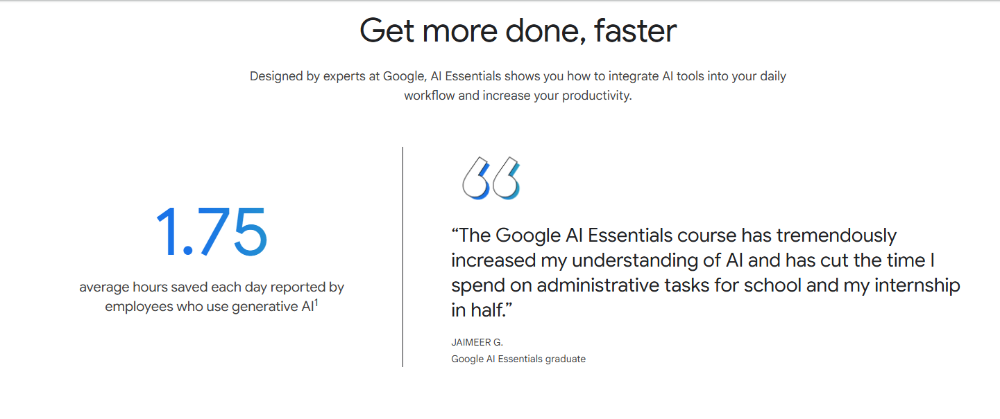
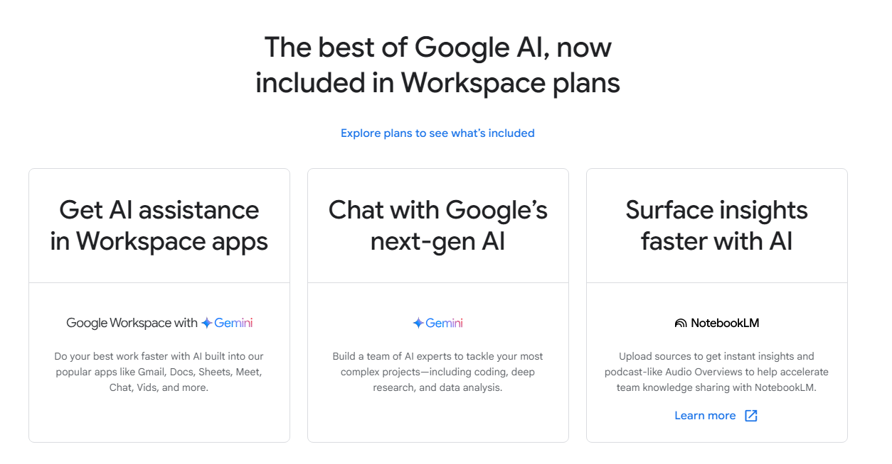

### **Google AI Essentials**
1. [Google AI Essentials](https://grow.google/ai-essentials/)

2. [Learn Skills by Grow with Google](https://grow.google/intl/en_pk/learn-skills/)

3. [Gemini](https://gemini.google.com/app)
4. [Google AI Studio](https://aistudio.google.com/prompts/new_chat)
5. [Workspace for Google](https://workspace.google.com)
6. [Google Workspace: AI-powered collaboration for organizations of all sizes](https://workspace.google.com/learning/content/google-workspace-ai-powered-collaboration-for-organizations-of-all-sizes?wgc=&utm_medium=et&utm_campaign=FY25-Q1-GLOBAL-GOO32537-website-dl-GOO32537-16464&utm_content=wgc-hp-tile-handbook&hl=en)
7. [Unleashing the power of NotebookLM: Your AI research and learning companion](https://workspace.google.com/learning/content/google-workspace-notebooklm-ebook?wgc=&utm_medium=et&utm_campaign=FY25-Q1-GLOBAL-GOO32668-website-dl-GOO32668-20608&utm_content=wgc-aipage-tile-handbook&hl=en)
8. [Gemini Advanced: Generative AI for Every Organization](https://workspace.google.com/learning/content/gemini-for-workspace-gemini-app-ebook?utm_source=wgc&utm_medium=et&utm_campaign=FY24-Q4-global-WKSP337-website-dl-gemini-advanced-ebook-gated-landing-page&utm_content=wgc-geminipage-tile-handbook&e=48754805&hl=en)
9. [Gemini Prompt Guide](https://workspace.google.com/resources/ai/#prompt-guide)
10. [Google Cloud](https://cloud.google.com)

### **Other LLM websites**
1. [ChatGPT](https://chatgpt.com/)
2. [Grok](https://grok.com)
3. [Microsoft Copiot](https://copilot.microsoft.com/)
4. [Meta AI](https://www.meta.ai/)
5. [Perplexity](https://www.perplexity.ai)
6. [Qwen](https://chat.qwen.ai)
7. [Claude](https://claude.ai/login?returnTo=%2F%3F)

### **Prompt Engineering: The Art of Guiding Generative AI**

##### What is a Prompt?

A **prompt** is the input or instruction you provide to an AI model to elicit a specific response. This can range from:

* **Simple questions:** "What is the capital of France?"
* **Keywords:** "Generate a poem about autumn."
* **Complex instructions:** "Write a marketing email for a new eco-friendly product, focusing on its sustainability features, and keep it under 150 words."
* **Code snippets:** For code generation models.
* **Examples:** Providing a few examples of desired output for the AI to learn from.
* **Contextual information:** Giving background information to help the AI understand the request better.

##### What is Prompt Engineering?

**Prompt engineering** is the iterative process of crafting and optimizing these prompts to guide generative AI models to produce the desired outputs. Prompt engineering is the art and science of communicating effectively with AI models, especially large language models (LLMs), to achieve precise and desired outputs. It involves designing, refining, and optimizing the input (the "prompt") given to an AI to guide its behavior and ensure it generates relevant, accurate, and high-quality responses. It involves:

* **Understanding the AI's capabilities and limitations:** Knowing what the model can and cannot do, and how it processes information.
* **Clarity and specificity:** Using precise language to avoid ambiguity and ensure the AI understands the intent.
* **Providing context:** Giving the AI necessary background information to generate relevant responses.
* **Defining the objective:** Clearly stating what you want the AI to achieve.
* **Iterative refinement:** Testing and adjusting prompts based on the AI's responses until the desired outcome is achieved. This often involves trial and error.
* **Utilizing various techniques:** Employing strategies like few-shot prompting, chain-of-thought prompting, and role-playing to improve results.

##### Importance of Prompt Engineering

Prompt engineering is crucial for several reasons:

* **Ensuring relevant and accurate outputs:** Without well-crafted prompts, AI models can produce irrelevant, generic, or even incorrect information. Prompt engineering helps to steer the AI towards useful and precise answers.
* **Maximizing AI potential:** It unlocks the full capabilities of LLMs, allowing users to leverage them for a wide range of complex tasks, from content creation and data analysis to problem-solving and decision-making.
* **Improving efficiency:** By generating precise responses on the first try, prompt engineering saves time and effort, increasing workflow efficiency.
* **Enhancing creativity:** It can spark new ideas and solutions by guiding the AI to explore different perspectives and generate creative content.
* **Mitigating bias:** Prompt engineers can work to reduce potential biases in AI-generated responses, promoting more objective and fair outputs.
* **Bridging the human-AI gap:** Prompt engineers act as a bridge between users and AI models, translating human intent into instructions that the AI can understand and execute effectively.

##### How it Works?

Prompt engineering works by leveraging the AI model's understanding of language and patterns. When you provide a prompt, the AI uses its training data to understand the request, predict the most probable sequence of words or information, and generate a response. Prompt engineering essentially provides a "roadmap" for the AI, guiding it through this process.

Key elements in how it works include:

1.  **Instruction following:** The AI attempts to follow explicit instructions given in the prompt.
2.  **Contextual understanding:** The AI analyzes any background information or examples provided to better grasp the meaning and nuances of the request.
3.  **Pattern recognition:** Through few-shot prompting or examples, the AI identifies patterns in the desired output and attempts to replicate them.
4.  **Iterative refinement:** If the initial output isn't satisfactory, the prompt engineer modifies the prompt by adding more details, changing phrasing, or trying different techniques, until the desired result is achieved. This is often a cyclical process of prompt -> response -> analysis -> refinement.
5.  **Technique application:** Different prompt engineering techniques (like "chain-of-thought" for complex reasoning) provide specific frameworks for the AI to process information and generate responses.

##### Examples of Prompt Engineering

Here are some examples illustrating different prompt engineering techniques:

* **Information Extraction:**
    * **Prompt:** "Extract the names of all companies mentioned in the following text: 'Apple Inc. announced record earnings, while Microsoft and Google also reported strong growth.'"
    * **Expected Output:** "Apple Inc., Microsoft, Google"

* **Content Generation (Creative):**
    * **Prompt:** "Write a short, whimsical story about a mischievous squirrel who tries to steal a magician's walnuts."
    * **Expected Output:** A creative narrative following the prompt's themes.

* **Role-Playing/Persona Setting:**
    * **Prompt:** "You are a seasoned marketing strategist. Explain the importance of SEO for a new e-commerce startup."
    * **Expected Output:** An explanation in the persona of a marketing strategist, likely using relevant terminology and insights.

* **Chain-of-Thought Prompting (for complex reasoning):**
    * **Prompt:** "A baker has 5 dozen cookies. They sell 3/4 of them. Then, they bake another 2 dozen. How many cookies do they have now? Let's break this down step-by-step."
    * **Expected Output:** The AI would show its reasoning process (e.g., calculate 3/4 of 5 dozen, then add 2 dozen) before giving the final answer.

* **Few-Shot Prompting (providing examples):**
    * **Prompt:** "Convert the following sentences into passive voice:
        * The dog chased the ball. -> The ball was chased by the dog.
        * She wrote a letter. -> A letter was written by her."
        * He built a house." -> A house was built by him."

##### Future of Prompt Engineering

The field of prompt engineering is constantly evolving. Here are some key trends and predictions for its future:

* **Automated Prompt Engineering with AI Tools:** AI models are increasingly being used to generate and optimize prompts themselves, reducing the manual effort required. This will make prompt engineering more accessible to non-experts.
* **Multimodal Prompt Engineering:** Beyond text, prompt engineering will increasingly involve other data formats like images, audio, and video. This means AI systems will be able to understand and generate responses in various modalities.
* **Prompt Personalization for Dynamic Responses:** AI will become more adept at tailoring responses to individual user preferences and historical interactions, leading to more personalized and adaptive experiences.
* **Ethical Prompt Engineering and Bias Mitigation:** Continued focus on developing prompts that minimize bias, promote fairness, and ensure responsible AI behavior.
* **Continuous Prompt Learning:** AI models will become more sophisticated in learning from past interactions and continuously improving their ability to understand and respond to prompts, even with less explicit guidance.
* **Integration into Everyday Applications:** Prompt engineering will become a seamless, often unnoticed, part of how we interact with AI in everyday tools and devices, from virtual assistants to smart home systems.
* **No-Code/Low-Code Platforms:** The rise of user-friendly platforms will allow individuals with little to no coding knowledge to effectively interact with and leverage AI models through intuitive prompt interfaces.
* **Prompt Standardization:** As AI becomes more ubiquitous, there may be a movement towards standardizing certain prompt structures and best practices to ensure consistent and reliable AI performance across different applications and industries.
* **Shift from "prompt engineer" to "AI interaction designer":** The role may evolve to focus more on designing intuitive interfaces and user experiences that implicitly guide AI, rather than just crafting explicit prompts.