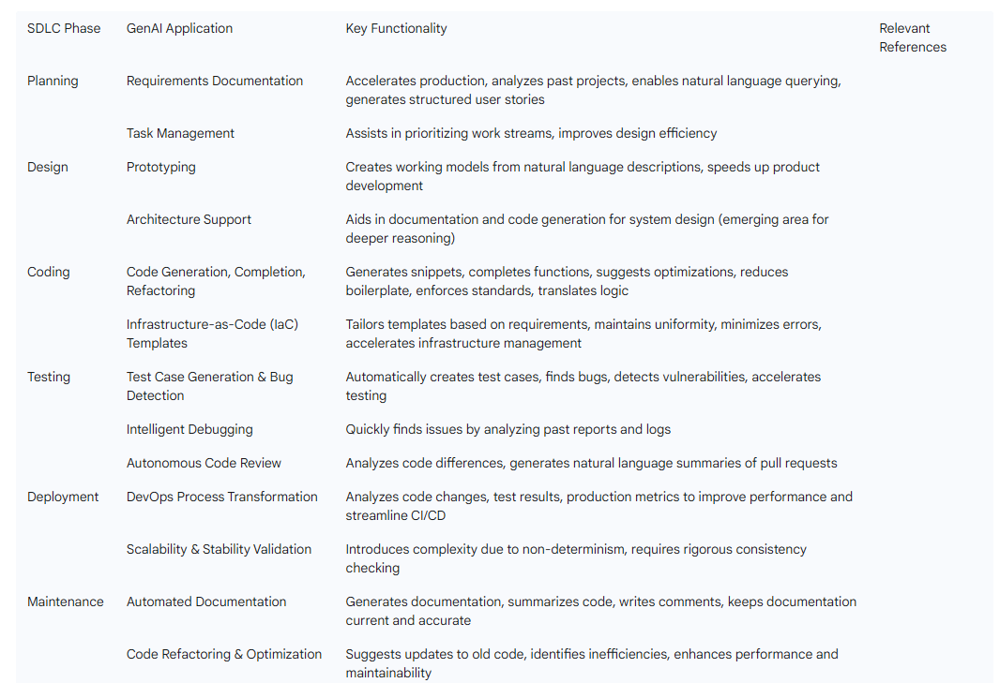

# Generative AI in Software Development: A Paradigm Shift for Researchers and Developers

## 1. Introduction: The Dawn of GenAI-Assisted Development
Generative Artificial Intelligence (GenAI) marks a profound evolution in the field of artificial intelligence, transcending traditional analytical capabilities to actively create novel content, encompassing text, code, images, and video. This emergent capacity is fundamentally reshaping knowledge work and, in particular, the foundational landscape of software development. The rapid integration of GenAI into development environments has captured significant attention within the Software Engineering community, driven by its potential to enhance and automate various facets of the software development lifecycle (SDLC).   

The adoption of GenAI within the industry is progressing swiftly. Industry reports indicate a substantial embrace of these technologies, with a significant percentage of enterprises already having GenAI use cases in their backlogs or having achieved product implementations. For instance, a Deloitte survey revealed that over a third of 2,770 organizations had achieved limited or at-scale product implementations of GenAI. This widespread and rapid integration underscores a pivotal shift in how software is conceptualized, built, and maintained.   

This report posits that GenAI is emerging not as a direct replacement for human developers but as a powerful collaborative assistant, poised to drive unprecedented levels of productivity, foster innovation, and streamline complex workflows. Its widespread adoption, however, necessitates a critical understanding and proactive management of inherent technical, security, intellectual property, and ethical challenges to ensure responsible and sustainable integration into the software engineering ecosystem. The rise of AI often elicits concerns about job displacement, yet the consistent emphasis across various analyses highlights GenAI's role as an "assistant" or "copilot". This perspective indicates a fundamental alteration in the nature of work rather than an outright automation of roles. The core value proposition centers on making developers more intelligent, efficient, and capable, rather than eliminating their necessity. This suggests a synergistic relationship where human creativity and critical thinking remain paramount, significantly augmented by AI's speed and automation. This evolving dynamic consequently requires a re-evaluation of developer skill sets, shifting the emphasis from purely coding-centric roles to those prioritizing prompt engineering, validation of AI output, and strategic problem-solving. Human oversight, therefore, stands as a crucial safeguard against the limitations inherent in AI systems.   

The high percentage of enterprises with GenAI use cases in their backlogs, as reported by the 2024 AI in Software Development Report (79%) , coupled with documented productivity enhancements—such as Goldman Sachs improving developer proficiency by 20% through auto-coding —signals considerable market pressure. Organizations are not merely exploring GenAI; they are actively implementing it to secure competitive advantages in terms of speed, efficiency, and innovation. This rapid adoption, however, carries an inherent risk: a potential rush to implementation without a full comprehension of the broader implications, particularly concerning intellectual property. This situation presents a dual challenge for organizations: how to rapidly integrate GenAI to maintain competitiveness while simultaneously establishing robust governance, security, and ethical frameworks to mitigate the inherent risks of a powerful, yet nascent, technology. The pace of technological advancement is presently outpacing the development of corresponding regulatory frameworks and established best practices.   

## 2. Understanding Generative AI: Core Concepts for Developers
Generative AI is a specialized subset of AI machine learning technologies characterized by its ability to rapidly create novel content in response to natural language prompts. This distinguishes GenAI from traditional AI systems, which primarily focus on analyzing existing data or are trained for specific, predefined functions. Unlike its predecessors, GenAI produces new and original content that, while resembling its training data, is not directly found within it. Traditional AI/ML systems are typically trained on data tailored to their intended function, whereas GenAI models undergo training on expansive, diverse datasets, often followed by fine-tuning on smaller, specialized datasets for specific tasks.   

At its core, GenAI employs machine learning, predominantly deep learning, utilizing neural network architectures often inspired by the human brain's structure. These intricate networks, composed of interconnected nodes, are trained on colossal datasets that encompass various forms, including text, images, and code. Many GenAI tools are built upon Large Language Models (LLMs) or other foundation models, which assimilate patterns from vast datasets to generate original content.   

The development of GenAI models typically involves a foundational pre-training phase, during which the AI analyzes immense datasets to identify underlying patterns, structures, and relationships. This process is commonly implemented using machine learning frameworks such as TensorFlow or PyTorch. Following this core training, models are frequently fine-tuned on smaller, more specific datasets to specialize them for particular functions. Additionally, alignment phases, such as Reinforcement Learning from Human Feedback (RLHF), are crucial for ensuring that the generated outputs align with human preferences and expectations. The quality, diversity, and sheer volume of the training data are paramount; rigorous cleaning and preprocessing are indispensable to eliminate noise and bias, as limitations in the dataset directly influence the model's performance and can lead to inaccurate or skewed results.   

The complex neural networks underlying GenAI models are trained on vast and often opaque datasets. A notable characteristic of these models is that it is generally not possible to predict their output or precisely determine the extent to which specific parts of the training data influence the generated content. This inherent opacity highlights the "black box" nature of these models. This complexity, combined with the critical importance of data quality, diversity, and volume, establishes a significant dependency: if the training data contains biases or errors, the model's output will inevitably reflect these flaws. This inherent complexity and lack of full interpretability mean that even with rigorous training, GenAI outputs are non-deterministic. Consequently, continuous human oversight, robust testing, and thorough validation of AI-generated content become indispensable, transforming the developer's role from sole creator to a crucial curator and validator of AI outputs. This also underscores the ethical imperative of proactively addressing and mitigating bias within training data.   

The concept of "foundation models" signifies that developers are increasingly building applications atop pre-trained, general-purpose models rather than undertaking the arduous task of training models from scratch for every new application. This approach significantly fast-tracks the exploration phase of the SDLC, enabling teams to transition directly to prompt engineering and fine-tuning. This dramatically lowers the barrier to entry for AI application development but fundamentally shifts the required expertise from deep model architecture knowledge to proficiency in effective prompt engineering and a nuanced understanding of model limitations. This transformation changes the traditional "build versus buy" decision for AI components. Organizations are now more likely to leverage powerful, pre-trained models and concentrate their efforts on fine-tuning and integrating these into specific workflows. This also creates a new form of dependency on the providers of these foundation models, raising important considerations regarding potential vendor lock-in, the frequency and nature of model updates, and long-term stability.   

## 3. GenAI's Impact Across the Software Development Lifecycle (SDLC)
Generative AI is revolutionizing how developers design, write, and maintain code, enhancing and automating various aspects of the software development lifecycle. It introduces a new paradigm centered on prompt engineering, model fine-tuning, and the management of inherently non-deterministic outputs. The influence of GenAI spans the entire SDLC, from initial planning to ongoing maintenance. This pervasive impact signifies a fundamental shift in development methodologies.   

**Applications Across SDLC Phases**
**Planning Phase:** In the initial stages, GenAI can significantly accelerate the production of requirements documentation, analyze insights from previous projects, and facilitate natural language querying of existing documentation. It streamlines the generation of clear, structured user stories and requirements by automating the analysis of large datasets, user feedback, and historical project information. Furthermore, AI-driven tools can assist in prioritizing work streams and enhancing efficiency in design functions.   

**Design Phase:** GenAI simplifies prototyping, allowing for the easy creation of working models from straightforward descriptions, effectively transforming everyday language into functional designs and accelerating product development. While its application in software architecture remains an emerging area, GenAI holds the potential to transform how complex systems are designed and optimized. Currently, its use is predominantly oriented towards documentation and code generation within this phase, with limited application in sophisticated system-level reasoning or trade-off analysis.   

**Build/Coding Phase:** This phase sees some of the most direct benefits. GenAI assists developers by generating code snippets, completing functions, and suggesting optimizations or refactoring opportunities tailored to the project's specific language and framework. This significantly reduces the need for writing repetitive boilerplate code. These tools can also generate contextual code suggestions, enforce coding standards, and even translate logic across different programming languages. For infrastructure management, GenAI can tailor Infrastructure-as-Code (IaC) templates based on specific user requirements, ensuring uniformity, minimizing errors, and accelerating deployment setups.   

**Testing and Quality Assurance Phase:** GenAI automates the creation of test cases and the identification of bugs, substantially reducing manual effort and accelerating the testing process whenever code changes. It can also detect potential vulnerabilities within the codebase. Debugging is improved as GenAI quickly identifies issues by analyzing past bug reports and logs, offering a significant advancement over traditional manual checking. For code review, GenAI tools can autonomously analyze differences between new and old code and generate natural language summaries of changes.   

**Deployment Phase:** AI is reshaping DevOps and Continuous Integration/Continuous Delivery (CI/CD) pipelines by analyzing code changes, test results, and production metrics. These insights lead to improved performance and streamlined the SDLC. However, GenAI applications introduce additional complexity due to their inherent non-determinism and potential dependency on third-party LLMs, necessitating more rigorous consistency checking and validation procedures during deployment.   

**Maintenance and Operations Phase:** GenAI tools automate the generation of documentation, summarizing code and writing comments, which saves considerable time and ensures documentation remains accurate and current. This also makes complex code more accessible for new team members. Furthermore, GenAI assists in code refactoring and optimization by suggesting updates to older codebases to align with modern practices. It identifies inefficient or outdated sections of code and recommends improvements, thereby enhancing code performance and maintainability.   

The following table summarizes GenAI applications across the SDLC phases:

Traditional software development and machine learning applications typically rely on concrete metrics and testing, aiming for deterministic outputs. However, GenAI introduces inherent non-determinism, necessitating more flexible evaluation methods and continuous adaptation. This means that the "Build phase" becomes fluid and experimental, driven by iterative prompt engineering. The challenge of unexpected outputs from an LLM can easily cascade across the system and create instability within other components, potentially causing system failure. This fundamental shift demands new development methodologies and testing paradigms. Developers must embrace a more iterative, exploratory, and adaptive approach, moving away from rigid, linear processes. It also highlights the need for robust monitoring and validation mechanisms post-deployment to manage potential model drift and performance degradation.   

The concept of an "AI Software Development Lifecycle" explicitly notes significant divergences from traditional ML approaches, particularly in the Build phase. While traditional ML focuses on model training with well-defined performance metrics, GenAI development centers on iterative prompt engineering and semantic analysis of responses, often with less concrete success metrics. This implies that integrating GenAI is not merely about adding a tool; it requires a fundamental re-thinking of the entire development process, from problem definition to deployment and continuous evaluation. The risk of projects getting "stuck at the Build phase" if success is not explicitly defined underscores this new complexity. Organizations cannot simply overlay GenAI tools onto existing SDLCs without adaptation. They need to develop an "AI SDLC" framework that accounts for the unique characteristics of GenAI, including its non-determinism, reliance on prompt engineering, and the need for continuous evaluation of contextual understanding and response quality. This also implies a need for new roles or specialized skills within existing teams to navigate this distinct lifecycle effectively.   

## 4. Benefits and Productivity Gains for Developers and Organizations
Generative AI is significantly enhancing speed and efficiency across software development. It substantially cuts time and boosts developer productivity by automating repetitive tasks such as setting up basic code, writing test cases, and documenting APIs, transforming tasks that once took hours into mere minutes. This translates into smoother work processes, faster product completion, and reduced operational costs. AI copilots are instrumental in driving speed and scale within development, without necessitating the replacement of human engineers. For example, Goldman Sachs reported a 20% improvement in developer proficiency through the use of auto-coding.   

By automating mundane tasks and generating boilerplate code, GenAI effectively frees up developers' time, allowing them to concentrate on complex, creative problem-solving and innovative design. AI assistants alleviate the mental burden associated with repetitive coding challenges by providing real-time code suggestions, enabling teams to maintain focus and avoid burnout. This qualitative shift in the developer's primary function elevates them from mere coders to strategic thinkers and innovators. This change could lead to more fulfilling and impactful roles for developers, but it also necessitates a re-evaluation of educational curricula and professional development programs to emphasize higher-order thinking, system design, and creative problem-solving over rote coding skills. The value proposition of a developer will increasingly be tied to their ability to leverage AI effectively for complex tasks.   

GenAI also contributes to improved code quality and error reduction. It possesses the capability to write entire functions, create comprehensive tests, identify errors, and suggest improvements to software structures. The technology enhances software testing and quality assurance by analyzing code, detecting potential vulnerabilities, and automatically generating test cases, which leads to more robust software systems. AI tools analyze code, identify errors, and suggest fixes in real-time, thereby expediting debugging and reducing the likelihood of overlooking difficult-to-identify vulnerabilities. Furthermore, AI-generated code often adheres to standardized patterns and best practices, fostering consistency across development teams. This consistency makes projects easier to understand, maintain, and collaborate on, even as teams expand or undergo member changes.   

The technology fosters innovation and experimentation by making it easier to try new approaches. It promotes a culture where developers can quickly test new ideas, build basic versions, and explore different options without the usual delays and costs. This "fail fast and cheaply" approach cultivates a more creative and dynamic work environment. It particularly encourages experimentation by suggesting unconventional solutions, prompting developers to explore novel approaches.   

In terms of scalability, GenAI offers a significant advantage by helping existing team members become more productive. This enables teams to manage larger projects without the traditional need to hire additional staff or allocate extra resources, thereby changing the conventional model of increasing development capacity through headcount.   

Finally, GenAI streamlines collaboration and DevOps processes. Its tools facilitate more efficient teamwork by bridging communication gaps through clear, usable code and automation. It reshapes DevOps and CI/CD pipelines by analyzing code changes, test results, and production metrics, leading to improved performance and a more streamlined SDLC. GenAI can further support agile and DevOps frameworks by providing unified views into complex systems, assisting in issue detection, and streamlining workflows.   

GenAI functions as a helpful coding assistant for developers across all experience levels. For new developers, it provides guidance, highlights potential issues they might otherwise miss, and helps them produce high-quality code more quickly. For seasoned software engineers, it accelerates the ideation process, minimizes context switching between complex tasks, and boosts overall productivity. This suggests that GenAI can act as a force multiplier, not only making experienced developers more efficient but also potentially lowering the barrier to entry for less experienced individuals to contribute meaningfully. This capability aligns with the idea of "growing without extra costs" by enhancing existing team productivity. However, this also introduces concerns about potential over-reliance  and the risk of hindering fundamental skill development if not managed appropriately. The aspect of "boosting skills"  must be carefully balanced with ensuring a deep, foundational understanding of the underlying code and principles.   

## 5. Key GenAI Tools and Platforms for Software Development
A diverse ecosystem of GenAI tools is rapidly emerging, ranging from integrated development environment (IDE) enhancements to specialized code review platforms. These tools are demonstrating their ability to seamlessly integrate into developers' workflows, providing an immediate boost to productivity. Leveraging large language models (LLMs) and other AI models, these applications can comprehend natural language, imagery, and code, enabling them to answer queries, reorganize information, and generate code snippets or written content.   

**Overview of Prominent AI Coding Assistants and IDEs**
- **GitHub Copilot:** This tool functions as an AI pair programmer, capable of writing functional code across a variety of languages, including Python, JavaScript, Go, PHP, Ruby, and Swift. A key differentiator is its ability to generate context-specific code suggestions by having comprehensive access to a project's architecture, style conventions, and existing context. This means it can create functions that utilize already defined variables, classes, and methods, moving beyond generic boilerplate code. Users also have the flexibility to select the underlying LLM from providers such as OpenAI, Google, or Anthropic. GitHub Copilot is primarily aimed at software developers who require an AI assistant integrated directly into their IDEs (e.g., Neovim, Visual Studio, Xcode) to accelerate coding tasks through context-aware suggestions.   

- **Google Gemini:** As Google's flagship GenAI offering, Gemini is proficient in coding across more than 20 programming languages, including Python, Java, C++, and JavaScript. Its capabilities include generating code from natural language prompts and comments, explaining existing code, and assisting with code refactoring. Gemini serves as a versatile coding assistant for developers working with a broad spectrum of programming languages. Its integration into Google Workspace plans makes it particularly suitable for users already within the Google ecosystem who seek AI assistance across various Google applications like Gmail and Google Docs.   

- **Cursor:** This platform represents an "AI-first" Integrated Development Environment (IDE), where artificial intelligence is not merely an optional add-on but a fundamental component of the coding experience. Features such as "Composer" enable the AI to operate on multiple files concurrently in an autonomous, agent-like manner. With comprehensive access to the entire codebase, Cursor can provide intelligent suggestions based on existing functions. Cursor is designed for engineers who desire a deeply integrated AI experience within their development environment, with AI playing a central role in streamlining and enhancing the coding process.   

- **Tabnine:** As an AI coding assistant, Tabnine supports various LLMs from OpenAI, Anthropic, Mistral, and Cohere to generate code suggestions. It offers auto-completion for entire lines of code or full functions and is capable of matching the style and conventions of an existing codebase. Tabnine targets developers seeking an AI coding assistant with extensive IDE compatibility, supporting a wider array of applications (e.g., Sublime, Eclipse, Neovim, Android Studio) compared to some competitors limited to a few major IDEs.   

**Specialized Tools for Code Review and Documentation**
- **What the Diff:** This tool is specifically designed to assist development teams with code review and enhance documentation. It integrates with GitHub and GitLab repositories. Upon the commitment of a pull request, What the Diff analyzes the differences between the new and old code and automatically generates a natural language summary of the changes. Beyond summaries, it can also refactor code based on prompts or comments and generate weekly reports summarizing team pull requests. It is beneficial for streamlining code review processes and making changes clearer for both technical and non-technical team members.   

- **OpenAI Codex (Historical Context):** OpenAI previously launched Codex, a cloud-based agent capable of working directly with code within a GitHub repository. It utilized a fine-tuned version of OpenAI's o3 reasoning model to answer questions about codebases and execute changes, such as fixing bugs or adding new features. Codex operated within a sandboxed environment without internet access, allowing it to test generated code safely before submitting a pull request.   

The following table provides a comparison of leading GenAI development tools:

While early tools primarily focused on code completion, exemplified by Tabnine's auto-completion capabilities , a notable advancement is the "agentic" shift in AI-assisted development. Newer tools, such as Cursor's "Composer," allow AI to "work on multiple files at once in an autonomous, agent-like manner". Similarly, OpenAI's Codex demonstrated the ability to "direct it to make changes, like fixing bugs and adding new features" and "test any code it creates in a safe environment before submitting a pull request". This progression indicates a move beyond mere code suggestion towards more autonomous, multi-step problem-solving capabilities. This agentic shift implies that AI tools are becoming more proactive and capable of handling larger, more complex tasks independently. While this could further accelerate development, it also significantly amplifies the necessity for robust human oversight and validation, as the AI's "decisions" become more complex and potentially impactful. This also raises critical questions about accountability when an "agent" makes errors across multiple files.   

Many of these tools are designed for seamless integration into existing IDEs, such as GitHub Copilot and Tabnine, or are embedded within broader ecosystems like Google Gemini in Google Workspace. Cursor, on the other hand, is designed as an "AI-first IDE itself". This highlights that the value derived from these tools is maximized when they are deeply and seamlessly integrated into a developer's existing workflow and environment. The choice of an AI tool may increasingly influence or be influenced by the broader development ecosystem. This could potentially lead to a form of ecosystem lock-in, where switching tools becomes more costly due to deep integration. Organizations must carefully consider their long-term integration strategy when adopting GenAI tools, prioritizing "tool integration" with existing environments. This also implies that tool providers will increasingly compete on the depth and breadth of their integrations and their ability to provide a comprehensive, cohesive AI-assisted development experience, potentially leading to platform competition in the GenAI space.   

## 6. Challenges, Risks, and Ethical Considerations in GenAI-Assisted Development

While Generative AI offers substantial benefits to software development, its widespread adoption introduces a complex array of challenges, risks, and ethical considerations that demand careful attention.

**Technical and Reliability Risks**
GenAI models are susceptible to hallucinations and inaccuracy, where they may generate entirely fabricated or factually incorrect information. Outputs, though often appearing coherent, may not always be based on factual information, necessitating third-party fact-checking. Another concern is    

**outdated data;** many models are trained on older datasets, meaning their suggestions might be irrelevant or not aligned with current market conditions. Over-reliance on AI models without significant human collaboration can lead to a    

**decrease in output quality and originality,** resulting in standardized products that lack creativity. While GenAI accelerates development, it does not inherently guarantee higher quality. AI-generated code, despite appearing functional, can contain errors, bugs, or vulnerabilities. Furthermore, GenAI applications introduce    

**non-deterministic outputs,** adding complexity and requiring more rigorous consistency checking and validation procedures. Unexpected outputs from an LLM can cascade through a system, potentially causing widespread instability. Over time, AI models can also experience    

model drift and performance degradation post-deployment, potentially introducing new biases or reducing effectiveness.   

**Security Vulnerabilities**
A significant concern is **insecure AI-generated code**, as research indicates that a substantial portion of such code contains common security vulnerabilities. Stanford University research, for instance, highlights that AI-generated code frequently contains security bugs.   

**Prompt injection attacks** represent another critical risk, where threat actors can manipulate AI systems into revealing sensitive information or bypassing security controls by embedding hidden commands or manipulating the data the model relies upon. The potential for    

**data leakage or sensitive data disclosure** is high, as GenAI models may inadvertently learn from information provided in prompts, risking exposure of protected intellectual property (IP) or confidential data. If organizations fail to anonymize training data or secure APIs, sensitive data can be intercepted or exposed. The phenomenon of    

**Shadow AI**, where employees use GenAI tools without official organizational sanction or knowledge, can inadvertently lead to the dissemination of incorrect information or copyright violations. The underlying    

**AI system and infrastructure security** themselves are also potential targets for cyberattacks. Risks extend to    

**AI supply chain vulnerabilities**, impacting the integrity of AI components. Lastly, GenAI can be used to create    

**supercharged social engineering** attacks, making phishing attempts and other cyberattacks appear more authentic and difficult to distinguish from human interaction.   

**Intellectual Property Concerns**
The legal landscape surrounding AI-generated code is complex, often described as a "digital Wild West". Traditional copyright law presumes human creativity, a presumption directly challenged by AI algorithms capable of producing functional, original code with minimal human guidance. This creates significant legal uncertainty regarding the IP ownership of AI outputs. A particularly acute tension lies in    

**open-source license contamination**. AI-generated code frequently incorporates or references existing libraries that carry specific licensing requirements (e.g., GPL), which can conflict with a company's intended use and expose them to substantial legal liabilities. A recent analysis by the Software Freedom Conservancy found that approximately 35% of AI-generated code samples contained licensing irregularities. Inputting    

confidential information into GenAI tools can lead to its exposure, as models may learn from prompts. Furthermore, GenAI tools are trained on vast quantities of IP-protected items, leading to ongoing legal disputes alleging infringement, and users of GenAI tools may also face infringement risks.   

**Ethical Implications**
A primary ethical concern is **bias**. If GenAI models are trained on biased data, they will inevitably reflect those biases in their output, potentially perpetuating harmful stereotypes or unfairly eliminating qualified candidates.   

**Transparency** is another critical issue; a lack of clarity in training processes (data sources, collection methods) raises concerns about data theft or misuse and hinders the ability to test output quality and accuracy.   

**Accountability** becomes challenging when AI systems make algorithmic decisions or "hallucinate" information, making it difficult to assign responsibility for unintended or reckless outputs. Developers, however, must take responsibility for the code they produce, even when generated by AI. There is also a risk of    

**developer over-reliance and skill degradation**, where developers may accept generated code without fully understanding it, potentially undermining their problem-solving skills and hindering a deeper comprehension of the codebase. This concern is shared by both students and practitioners. The broader    

**workforce impact** is also a consideration, with fears that AI could replace large sections of the workforce, necessitating upskilling or career shifts. However, some analyses suggest GenAI will create new roles and prompt upskilling. Finally, GenAI presents various    

**misuse scenarios**, as adversaries can leverage it to generate malicious content, deepfakes, or biased outputs, impacting businesses and individuals.   

The following table summarizes key GenAI risks and associated mitigation strategies:

The risks associated with GenAI are often interconnected and can cascade throughout the development and deployment process. For instance, bias in training data  can lead to biased outputs, which in turn may manifest as inaccurate claims  or insecure AI-generated code if the bias leads to flawed logic or vulnerabilities. Insecure code, if deployed, becomes susceptible to exploitation through prompt injection attacks  or can result in sensitive data disclosure. This data leakage, particularly of confidential information , directly exacerbates privacy and intellectual property concerns. Furthermore, the unauthorized use of "shadow AI"  bypasses organizational controls, thereby amplifying all these risks. This demonstrates a clear chain where a vulnerability in one area can trigger or intensify issues in others. Mitigating GenAI risks therefore requires a holistic, multi-layered approach rather than addressing each risk in isolation. Organizations need integrated security, legal, and ethical frameworks that consider the entire lifecycle of GenAI adoption, from data acquisition and model training to deployment and continuous monitoring. A failure in one area, such as data quality, can have ripple effects across security, reliability, and legal compliance.   

A significant challenge is the regulatory lag in the legal landscape. The intellectual property laws in most countries were drafted prior to the advent of AI, leading to considerable uncertainties regarding the ownership of rights in AI outputs. This situation is further underscored by descriptions of the legal environment as a "digital Wild West," characterized by outdated case law ill-suited to the realities of machine learning capabilities. The ongoing legal disputes  and the "existential threat" posed by open-source license contamination  highlight a substantial gap between rapid technological advancement and the slower evolution of legal and regulatory frameworks. This regulatory lag creates significant legal and economic risks for companies adopting GenAI, particularly those investing heavily in proprietary AI code generators. The absence of clear legal precedent places the onus on organizations to develop their own ethical frameworks  and responsible AI policies. This necessitates proactive internal policies , robust due diligence (including vetting datasets and seeking indemnities), and meticulous documentation of AI model training and human oversight to navigate this uncertain legal terrain.   

## 7. Human-AI Collaboration: Reshaping Developer Roles and the Future of Programming

Generative AI is fundamentally reshaping how software is built, boosting output, reducing friction, and transforming engineering practices. It operates as a collaborative assistant, making developers more intelligent, faster, and more capable, thereby complementing human capabilities rather than competing with them. Gartner predicts that by 2027, GenAI will lead to the creation of new roles in software engineering and operations, prompting 80% of engineers to upskill. This shift is not merely an option but a strategic imperative for career longevity and organizational competitiveness. The increasing demand for adaptability and specialized expertise  means that continuous learning and adaptability, once considered soft skills, are now core technical requirements for navigating the GenAI landscape. Failure to upskill could lead to a widening skills gap, potentially marginalizing segments of the developer workforce and hindering an organization's ability to fully leverage GenAI.   

**The Irreplaceable Human Touch**
Despite the advancements in AI, certain aspects of software development remain intrinsically human and irreplaceable:

**Creativity and Innovation:** While AI automates routine tasks, the conceptual brainstorms, the design of new functionalities, and the creation of unique user experiences that lead to truly innovative software are deeply human endeavors. Developers are creators who think outside the box, innovate, and iterate in ways that machines cannot.   

**Critical Thinking and Problem-Solving:** Developers must maintain active involvement in the coding process, ensuring that AI suggestions align with project goals and requirements. Human oversight is crucial for validating the logic, performance, and compatibility of AI-generated code within the existing system.   

**Teamwork and Communication:** Collaboration, effective communication, and the understanding of nuanced human emotions are vital components of software development that AI struggles to replicate. Tech environments thrive on the dynamic exchange of ideas, a deep understanding of client needs, and the ability to pivot based on user feedback—all human-centered activities.   

**Continuous Learning and Adaptability:** Human software engineers consistently learn and evolve, bringing fresh perspectives from their varied experiences. This innate adaptability is a critical advantage over AI, which requires updates and reprogramming to acquire new knowledge or adapt to new paradigms.   

The analogy of AI as a "sous chef" and the software engineer as the "head chef"  vividly illustrates the emerging division of labor. The AI handles the preparatory, routine tasks, while the human retains creative control, strategic decision-making, and the responsibility for the "exquisite dish" of the final product. This implies a profound transformation of required skills: a reduced emphasis on rote syntax memorization and an increased focus on high-level design, architectural thinking, effective prompt engineering, and critical evaluation of AI outputs. The "unpredictable nature of GenAI"  further necessitates human judgment and adaptability. This necessitates a significant shift in developer education and training. Future developers will need to be proficient in "AI literacy"—understanding how to interact with, manage, and validate AI systems—alongside their traditional programming skills. The value of "soft skills" like collaboration, communication, and adaptability  becomes even more pronounced as human teams leverage AI.   

**Evolving Skill Sets for Developers**
The integration of GenAI is necessitating an evolution in the skill sets required for software developers:

**Prompt Engineering:** Developers need to be adept at providing clear instructions and context to the AI to generate relevant and effective solutions. This involves understanding how to frame queries to elicit the desired output.   

**AI Model Management and Oversight:** Developers are increasingly expected to select, manage, and effectively integrate multiple AI models into existing systems. This includes the critical task of reviewing AI-generated code for quality, efficiency, and adherence to best practices.   

**Ethical Reasoning and Bias Mitigation:** Developers must ensure that the code they produce, even if AI-generated, aligns with ethical principles and does not inadvertently cause harm. This includes critically evaluating AI outputs for potential biases.   

**Strategic Thinking:** With repetitive tasks automated, developers are freed to focus on more strategic tasks rather than mundane coding operations. This involves higher-level system design, feature prioritization, and long-term architectural planning.   

**Emergence of New Roles**
The unpredictable nature of GenAI is driving the creation of entirely new roles focused on AI safety, data responsibility, and model management. Positions may emerge specializing in overseeing the ethical implications of AI deployment, meticulously reviewing and approving code generated by AI systems, and managing the entire lifecycle of AI applications.   

A critical concern arising from the integration of GenAI is the potential for developer over-reliance on these tools, where users may accept generated code without fully understanding it. This "loss of understanding" can have measurable impacts on source code knowledge models, which are used to identify developer expertise, and metrics such as the "Truck Factor" (a measure of knowledge concentration within a codebase). If a significant portion of the codebase is generated by AI, and human developers do not fully comprehend it, the collective knowledge concentration within the human team could decrease. This makes the project more vulnerable if key human experts depart or if the AI tool itself becomes unavailable or unreliable. This highlights a subtle but profound risk to organizational resilience and long-term maintainability. While GenAI certainly boosts individual productivity, it could inadvertently create a "knowledge debt" within the team. Organizations must implement strategies to counteract this, such as mandatory human review of all AI-generated code, implementing AI pair programming practices , and investing in training initiatives focused on deep understanding rather than merely rapid output. The reliability of traditional expertise metrics may diminish as GenAI becomes more integrated , necessitating new approaches to assess and manage team knowledge.   

## 8. Best Practices for Responsible and Secure GenAI Adoption
To harness the transformative potential of Generative AI in software development while mitigating its inherent risks, organizations must adopt a multi-faceted strategy encompassing policy, training, robust security, and continuous human oversight.   

**Establishing Clear AI Integration Guidelines and Policies**
Organizations must define clear roles and responsibilities for both human developers and AI agents to create structured workflows that maximize efficiency. It is crucial to document AI tool usage protocols, outlining precisely when and how these tools should be employed within development workflows. This documentation should also establish clear standards for code review processes that incorporate AI assistance while maintaining human oversight and accountability. Thoughtful GenAI policies should be crafted, avoiding outright bans, which can stifle innovation and inadvertently encourage "shadow AI". Furthermore, organizations must implement acceptable use policies and ensure a comprehensive understanding of all relevant AI compliance obligations.   

**Cultivating Team Expertise and Continuous Learning**
Proactive employee training on GenAI tools and best practices is critical. Training programs should be designed to accommodate varying skill levels, ideally starting with smaller, low-risk projects to build confidence and demonstrate value. Cultivating a mindset of continuous learning is essential for developers to keep pace with the rapid advancements in GenAI technologies. Encouraging knowledge sharing among team members is also vital, as different developers may discover unique and effective ways to leverage AI tools.   

**Ensuring Robust Security Protocols and Compliance**
Implementing security measures from the outset is paramount. This includes adopting zero-trust security controls for GenAI applications.   

Data protection measures must be robustly applied throughout the entire GenAI lifecycle—from training and fine-tuning to inference. This involves assessing and classifying data sensitivity, continuously monitoring sensitive data, and developing comprehensive data access and usage policies based on the principle of least privilege. Sensitive training data should be anonymized or encrypted to prevent exposure.   

Input validation and filtering are critical to prevent prompt injection attacks; all user inputs must be completely validated before processing. This requires multi-layered filtering techniques, including regular expressions, anomaly detection, and the rejection of obfuscated content. The underlying    

AI system and infrastructure must also be secured.   

Regular auditing and monitoring are essential, including periodic audits of AI-generated code for security issues and quality standards. AI interactions should be continuously monitored, logging inputs and outputs to detect unusual patterns. Post-deployment, system performance must be tracked to identify and address model drift or emerging biases.   

Organizations must ensure compliance excellence, verifying that AI tools meet stringent industry regulations and data privacy requirements, especially when handling sensitive information. This involves documenting applicable regulations for each GenAI use case and conducting impact assessments for high-risk AI applications. Finally,    

red teaming—creating internal teams to simulate attacks—is a valuable practice for identifying and mitigating vulnerabilities proactively.   

The imperative of proactive governance and "Security by Design" is evident. The need for "clear guidelines" , "thoughtful GenAI policies" , and "robust security protocols"  is not a reactive measure but a proactive one. This involves implementing "zero-trust security" , "data protection measures" , and "input validation". The emphasis on "designing a secure generative AI system"  and "customizing your GenAI architecture"  points to integrating security considerations from the very outset of GenAI implementation, rather than as an afterthought. Organizations must move beyond ad-hoc GenAI use towards a formalized governance framework. This includes establishing dedicated roles (e.g., AI safety, data responsibility ), investing in AI-specific security tools , and integrating AI security into existing DevSecOps pipelines. The observation that "speed can turn into risk without safeguards"  highlights that rapid adoption without a strong security and governance foundation is highly perilous.   

**Implementing Human Oversight and Iterative Refinement of AI Outputs**
Human oversight remains indispensable. Developers must always review AI-generated code to ensure it aligns with project requirements, adheres to best practices, and validate its logic, performance, and compatibility with the existing codebase. AI suggestions should be treated as a starting point rather than a final solution; developers should actively collaborate with the AI by providing feedback and iteratively refining its outputs to achieve the desired results. Automated testing frameworks, including unit tests, integration tests, and static code analysis tools, should be utilized to identify potential issues in AI-generated code early in the development process.   

**Mitigating Bias and Ensuring Transparency**
Developers must critically evaluate AI-generated code for bias and ensure that it does not perpetuate harmful stereotypes or discriminatory practices. This requires training models with comprehensive, diverse data and iteratively retraining them to reduce bias. Maintaining transparency in how AI tools are used is crucial, including documenting instances of AI-generated code and providing clear explanations for its inclusion. Prioritizing explainable AI methods can further enhance understanding and accountability. Additionally, all AI-generated content should be clearly labeled.   

**Developing Incident Response Plans**
Organizations should proactively develop GenAI-specific incident response plans. This includes requiring human approval for sensitive actions generated or suggested by AI systems.   

The regulatory landscape surrounding GenAI is continuously evolving. Mentions of a "changing regulatory landscape" , "new laws, regulations, policies, and guidelines" , and specific references to the EU AI Act  underscore that best practices are not static. Organizations must "keep defenses current"  and "adapt to privacy and safety principles"  as regulations mature. The need for a "continuous improvement culture"  and for "monitoring and addressing adoption challenges"  highlights that GenAI integration is an ongoing process of learning and refinement, rather than a one-time deployment. This requires agile governance and compliance mechanisms that can evolve with both technological advancements and regulatory changes. Such agility necessitates cross-functional collaboration among engineering, legal, privacy, and security teams to ensure continuous alignment. The emphasis on "transparency"  is not merely an ethical consideration but also a practical necessity for demonstrating compliance and building trust in a rapidly changing environment.   

## 9. Conclusion: Navigating the Future of Software Development with GenAI

Generative AI has undeniably ushered in a new era for software development, fundamentally altering traditional practices and reshaping the roles of developers. It has proven to be a powerful catalyst for enhanced productivity, accelerated innovation, and streamlined workflows across the entire Software Development Lifecycle. By automating mundane tasks and augmenting human capabilities, GenAI allows developers to focus on higher-value, creative problem-solving.   

The future trajectory of GenAI's role in software development anticipates further expansion throughout the lifecycle, potentially leading to a substantial reduction in the volume of code required to achieve functional objectives. Continued innovations in AI-assisted coding, automated software optimization, and enhanced collaboration tools will make development more efficient and accessible. Future research must address current limitations, particularly in areas like software architecture , system-level reasoning, trade-off analysis, and performance modeling. A continued focus on robust evaluation methods beyond mere usability and accuracy metrics is crucial to ensure the quality and reliability of AI-assisted systems.   

The integration of GenAI is not merely a technological shift but a significant cultural transformation within the industry. To fully harness its potential, developers must embrace continuous learning and adapt their skill sets to include AI model management and prompt engineering, cultivating a mindset of critical oversight. Gartner's prediction that 80% of engineers will need to upskill by 2027  is a strong indicator that GenAI is not just a tool, but a fundamental shift requiring a proactive response from the workforce. This is not optional; it is a strategic mandate for career longevity and organizational competitiveness. The increasing demand for adaptability and specialized expertise  means that continuous learning, previously considered a soft skill, is now a core technical requirement for navigating the GenAI landscape. Educational institutions, corporate training programs, and individual developers must prioritize AI literacy, prompt engineering, AI model management, and ethical considerations. Failure to upskill could lead to a widening skills gap, potentially marginalizing segments of the developer workforce and hindering an organization's ability to fully leverage GenAI.   

Organizations must prioritize responsible AI adoption by establishing clear integration guidelines, implementing robust security and privacy protocols, fostering transparency, and actively mitigating biases. Addressing the complex intellectual property landscape and ensuring accountability will be paramount for sustainable growth. While the technical capabilities of GenAI are rapidly advancing, various analyses consistently highlight the ethical challenges , legal uncertainties , and the need for new laws and standards. The description of the IP landscape as a "digital Wild West"  and the observed absence of rigorous evaluation in areas like architectural quality  suggest that the next frontier in GenAI-assisted development is not merely about building more powerful models, but about establishing robust ethical, legal, and governance frameworks. The development of an ethical framework is critical  because it is far too easy to unintentionally misuse GenAI's potential. The long-term success and societal acceptance of GenAI in software development hinge on the ability of researchers, developers, policymakers, and organizations to collaboratively define and enforce responsible AI practices. This includes not only technical safeguards but also clear guidelines on accountability, transparency, bias mitigation, and intellectual property. The future of software development is not just about code, but about the ethical and legal scaffolding that supports it. The future of software development is a collaborative endeavor between humans and intelligent machines, demanding a strategic, ethical, and continuously adaptive approach to unlock unprecedented possibilities while safeguarding against inherent risks.   

