## FastAPI: The Modern Python Powerhouse for High-Performance APIs

FastAPI has rapidly become the darling of the Python web development world, and for good reason. It's a modern, high-performance web framework designed for building APIs with Python 3.8+ that emphasizes speed, developer productivity, and robust features. Built on top of Starlette for the web parts and Pydantic for data validation, FastAPI offers a compelling solution for a wide range of applications, from microservices to AI-powered backends.

This article will delve into the core aspects of FastAPI, exploring its fundamental concepts, advanced capabilities, integration potential, and essential best practices for building robust and scalable applications.

-----

### I. Core Concepts: The Building Blocks of Your FastAPI Application

At its heart, FastAPI provides intuitive and powerful tools to define your API endpoints and handle data.

  * **Path Operations:** The core of defining your API. Using decorators like `@app.get()`, `@app.post()`, `@app.put()`, `@app.delete()`, etc., you link HTTP methods and paths to Python asynchronous functions (`async def`). These functions are where your business logic resides.

    ```python
    from fastapi import FastAPI

    app = FastAPI()

    @app.get("/")
    async def read_root():
        return {"message": "Hello, FastAPI!"}
    ```

  * **Request Bodies:** FastAPI leverages Pydantic models to define the structure and validation rules for incoming request data (e.g., JSON payloads for POST or PUT requests). This provides automatic data parsing, validation, and clear error messages to the client.

    ```python
    from pydantic import BaseModel

    class Item(BaseModel):
        name: str
        description: str | None = None
        price: float
        tax: float | None = None

    @app.post("/items/")
    async def create_item(item: Item):
        return item
    ```

  * **Response Models:** Just as Pydantic validates incoming data, it can also define the structure of your API's responses. By specifying `response_model` in your path operation decorator, FastAPI automatically serializes your Python objects into JSON and ensures the output conforms to the defined schema. This is invaluable for API consumers and auto-generated documentation.

  * **Dependencies:** One of FastAPI's most powerful features. The `Depends` system allows you to declare "dependencies" – functions or classes that your path operations or other dependencies rely on. This promotes code reusability, modularity, and makes testing significantly easier. Common uses include database session management, authentication, and authorization.

    ```python
    from fastapi import Depends, HTTPException, status

    async def get_current_user():
        # Simulate user authentication
        user = {"username": "johndoe"}
        if not user:
            raise HTTPException(status_code=status.HTTP_401_UNAUTHORIZED, detail="Not authenticated")
        return user

    @app.get("/users/me/")
    async def read_users_me(current_user: dict = Depends(get_current_user)):
        return current_user
    ```

  * **Security:** FastAPI provides robust support for various security schemes, including OAuth2 (with JWT tokens), HTTP Basic authentication, API keys, and more. These are easily integrated using the `fastapi.security` module and the `Depends` system.

  * **Middleware:** Functions that run for every request, before your path operation is executed, and often after it has finished and the response is generated. Middleware is perfect for cross-cutting concerns like logging, adding custom headers, or handling CORS.

  * **Testing:** Thanks to its Starlette foundation, FastAPI applications are highly testable. The `TestClient` utility, powered by `httpx`, allows you to simulate requests to your application without needing a running server, making unit and integration testing fast and reliable.

-----

### II. Advanced Topics: Pushing the Boundaries

FastAPI extends beyond basic API creation with powerful features for complex scenarios.

  * **Background Tasks:** For operations that don't need to block the immediate HTTP response (e.g., sending emails, processing large files), FastAPI's `BackgroundTasks` allow you to offload these to be executed after the response has been sent.

    ```python
    from fastapi import BackgroundTasks, FastAPI

    app = FastAPI()

    def write_log(message: str):
        with open("log.txt", "a") as log:
            log.write(message + "\n")

    @app.post("/send-notification/")
    async def send_notification(email: str, background_tasks: BackgroundTasks):
        background_tasks.add_task(write_log, f"Notification sent to {email}")
        return {"message": "Notification will be sent in the background"}
    ```

  * **WebSockets:** FastAPI offers native support for WebSockets, enabling real-time, bidirectional communication between clients and your server. This is ideal for chat applications, live dashboards, and other interactive experiences.

  * **Custom Dependency Injection:** While `Depends` is powerful, you can create even more sophisticated dependency patterns, including class-based dependencies, dependencies that yield resources (for cleanup), and dependencies that depend on other dependencies.

  * **Testing Strategies:** Beyond basic `TestClient` usage, advanced testing involves mocking external services (databases, third-party APIs) to ensure isolated unit tests, and implementing comprehensive integration and end-to-end tests for critical flows. Pytest fixtures are essential for setting up test environments.

  * **Deployment:** FastAPI applications are typically deployed using ASGI servers like Uvicorn or Hypercorn, often within Docker containers for portability and consistency. Orchestration tools like Kubernetes are commonly used for managing scaled deployments.

-----

### III. Integrations: Connecting to the Ecosystem

FastAPI's design makes it highly compatible with a wide array of Python libraries and tools.

  * **Databases:** FastAPI doesn't dictate a specific ORM or database. You can seamlessly integrate with:

      * **SQLAlchemy:** A powerful and flexible ORM for relational databases.
      * **Tortoise ORM:** An `asyncio` ORM, well-suited for FastAPI's asynchronous nature.
      * **Asyncpg:** A high-performance PostgreSQL driver for direct asynchronous database interaction.
      * And many others, often managed through dependencies that provide a database session for each request.

  * **Authentication & Authorization:** Beyond the built-in security features, you can integrate with:

      * **OAuth2 / JWT:** For token-based authentication. Libraries like `python-jose` are commonly used.
      * **FastAPI Users:** A popular library that provides ready-to-use user management, authentication, and authorization components.

  * **Testing Tools:**

      * **Pytest:** The de-facto standard for Python testing, offering a rich plugin ecosystem.
      * **`httpx`:** The asynchronous HTTP client that powers FastAPI's `TestClient`, also useful for making requests to external APIs within your application.

-----

### IV. Best Practices: Building Robust and Maintainable Applications

Following these guidelines will lead to more organized, scalable, and maintainable FastAPI projects.

  * **Project Structure:** For larger applications, avoid putting everything in `main.py`. A common and effective structure includes:

      * `app/`:
          * `main.py`: The main FastAPI application instance.
          * `routers/`: Separate files for different API resource groups (e.g., `users.py`, `items.py`) using `APIRouter`.
          * `schemas/`: Pydantic models for request and response data.
          * `models/`: Database models (if using an ORM).
          * `crud/` or `services/`: Business logic for interacting with databases or external services.
          * `dependencies/`: Reusable dependency functions.
          * `core/`: Configuration, settings, and other core components.
      * `tests/`: Your test files.
      * `alembic/` (for SQLAlchemy migrations).

  * **Error Handling:**

      * **`HTTPException`:** The primary way to signal HTTP errors to clients. Raise `HTTPException` with appropriate `status_code` and `detail` messages.
      * **Custom Exception Handlers:** For more granular control or to handle custom exceptions, use `@app.exception_handler()` to register functions that catch specific exceptions and return custom JSON responses.
      * **Validation Errors (422 Unprocessable Entity):** FastAPI automatically handles Pydantic validation errors by returning a 422 status code with detailed error messages. You can customize this behavior with a `RequestValidationError` handler.

  * **Performance Optimization:**

      * **Asynchronous I/O:** Always use `async`/`await` for I/O-bound operations (database queries, network requests) to prevent blocking the event loop. Use `async` database drivers (e.g., `asyncpg`, `Tortoise ORM`).
      * **Uvicorn with `uvloop`:** Use `uvloop` as the event loop for Uvicorn for maximum performance.
      * **Caching:** Implement caching strategies (in-memory, Redis) for frequently accessed data.
      * **Database Query Optimization:** Ensure your database queries are efficient, use proper indexing, and avoid N+1 problems.
      * **Gzip Compression:** Enable Gzip middleware for smaller response sizes.
      * **Background Tasks:** Offload long-running operations.
      * **Profiling:** Use profiling tools (e.g., `cProfile`, `yappi`) to identify performance bottlenecks.

  * **Documentation (OpenAPI/Swagger UI):** FastAPI automatically generates interactive API documentation (Swagger UI at `/docs` and ReDoc at `/redoc`) from your path operations and Pydantic models. Ensure descriptive docstrings and proper type hints for rich documentation.

-----

### V. Troubleshooting: Common Pitfalls and Solutions

Even with a well-designed framework, issues can arise.

  * **`422 Unprocessable Entity`:** Often indicates a Pydantic validation error. Check your request body against the expected Pydantic model for missing required fields, incorrect data types, or invalid formats. The error message usually provides precise details.
  * **`500 Internal Server Error`:** A generic server-side error. This usually means an unhandled exception occurred in your code. Check your server logs for stack traces to pinpoint the exact issue. Implement global exception handlers (`@app.exception_handler(Exception)`) for better insights during development, but avoid exposing detailed error messages in production.
  * **Blocking I/O:** If your application feels slow, especially under load, check for synchronous I/O operations (e.g., `time.sleep()`, synchronous database drivers, or `requests` library calls without `httpx`) inside `async def` functions without proper handling. These can block the event loop.
  * **Dependency Injection Failures:** If a dependency isn't being injected correctly, double-check your `Depends()` calls and ensure the dependency function or class is correctly defined and its own dependencies (if any) are met.

-----

### Conclusion

FastAPI is more than just another Python web framework; it's a paradigm shift in how we build high-performance, maintainable, and developer-friendly APIs. By embracing Python's type hints, Pydantic for data validation, and Starlette's asynchronous capabilities, FastAPI empowers developers to create robust and scalable solutions with remarkable speed.

Whether you're starting a new microservice, building a machine learning API, or revamping an existing backend, FastAPI provides the tools and flexibility to achieve your goals with elegance and efficiency. Dive in, experiment, and leverage its powerful features to build the next generation of web applications.

#### API

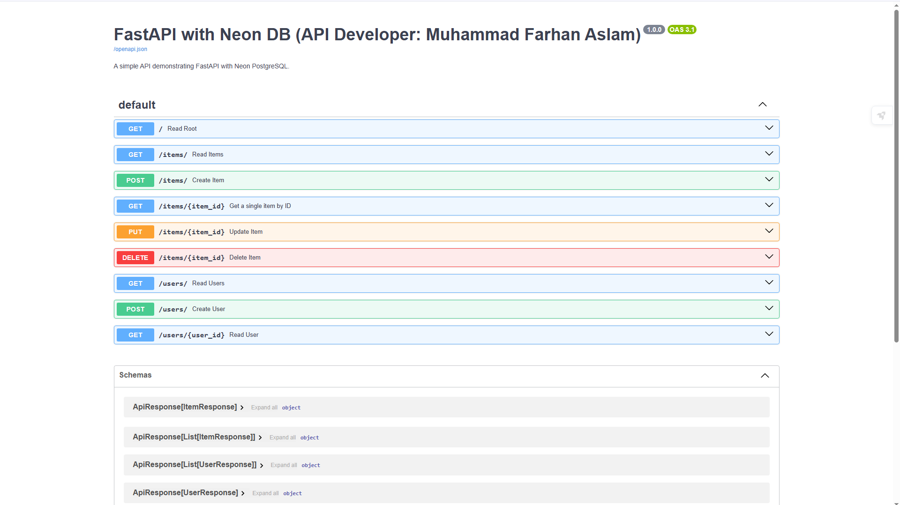

#### Post Request

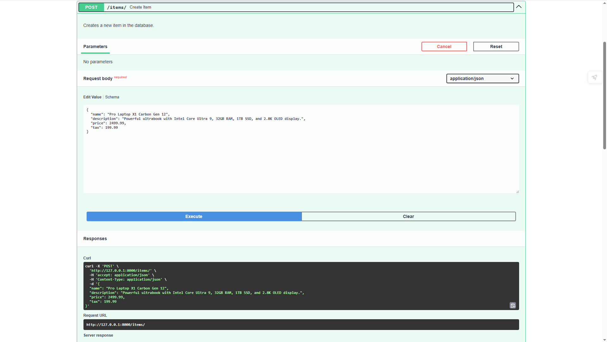

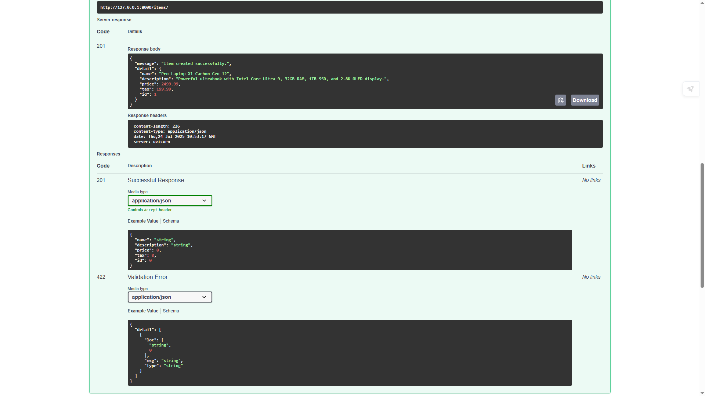


#### Get Request

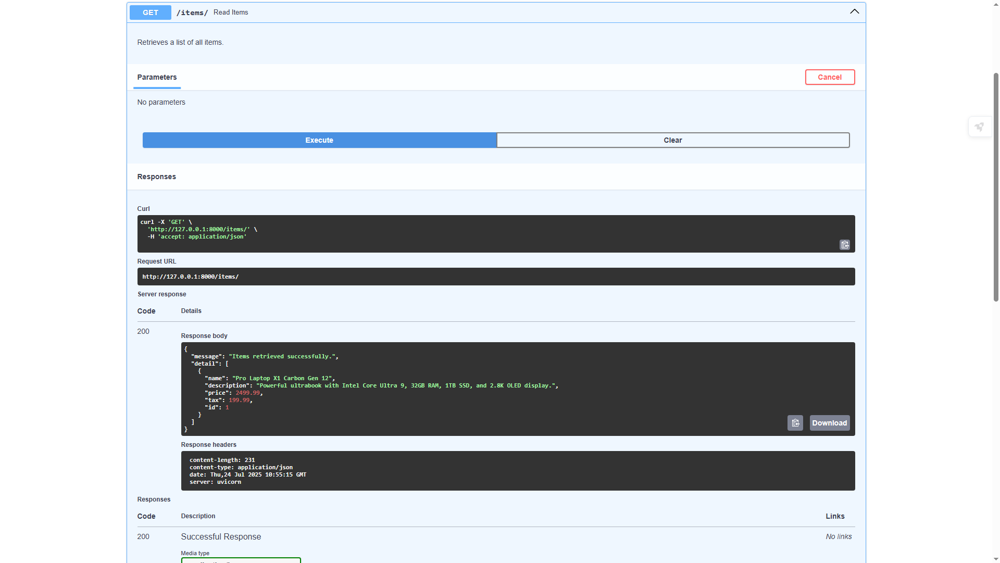

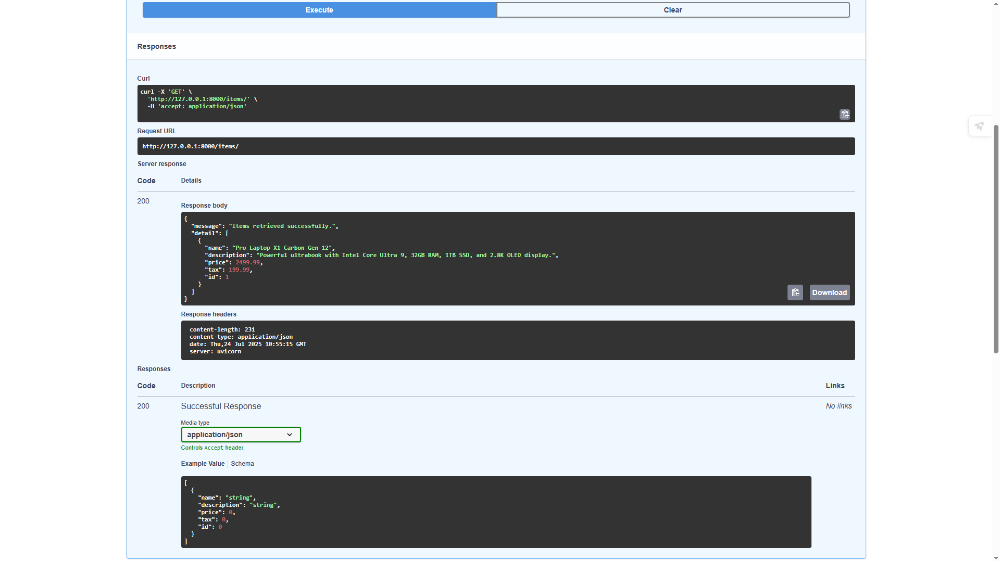

#### Get a single item by ID

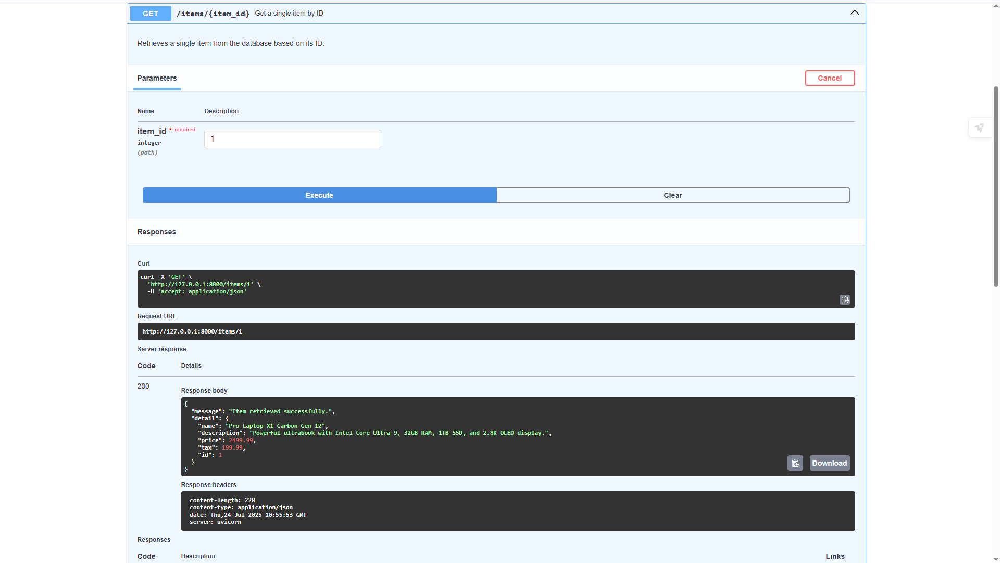

# Put Request

Adding one more item in database to make canges

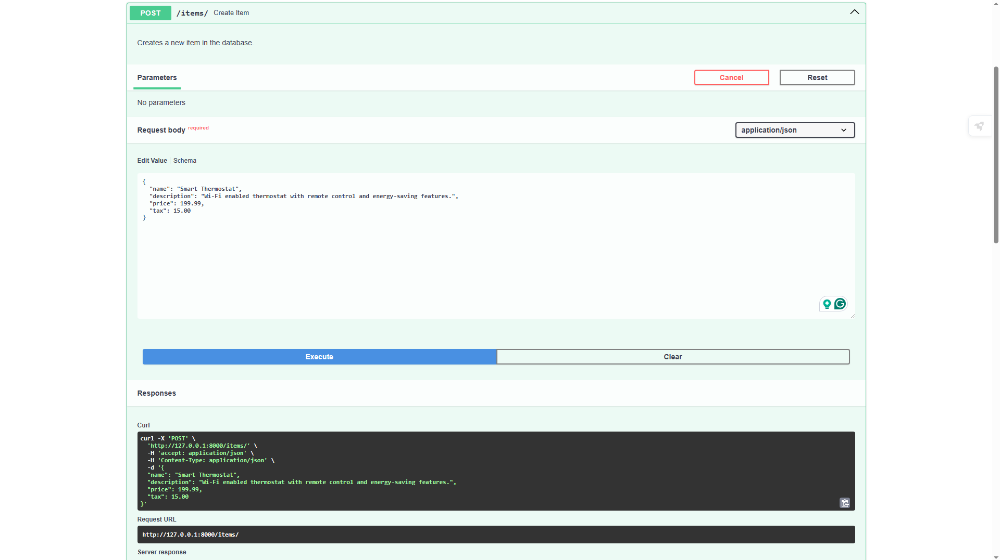

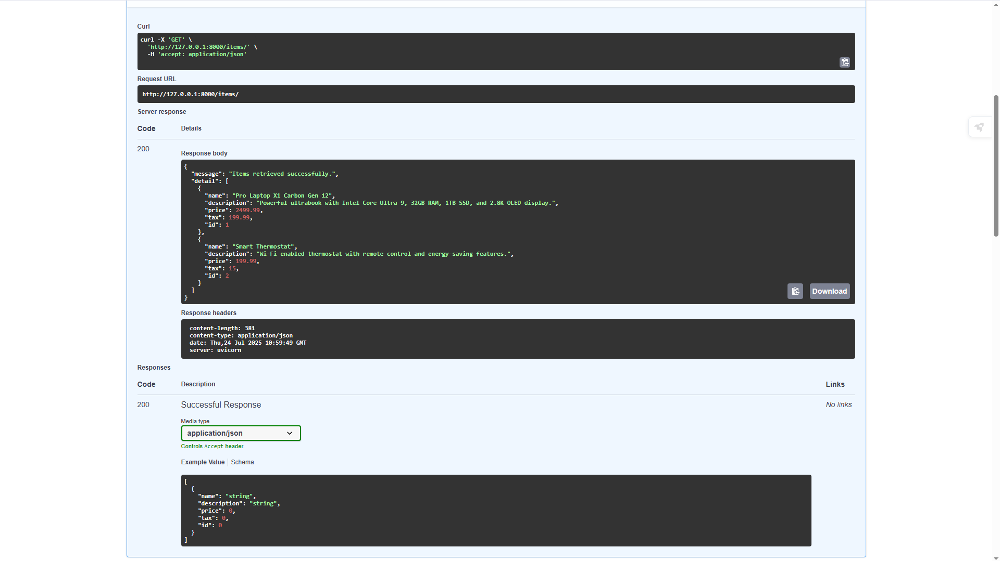

After update the information

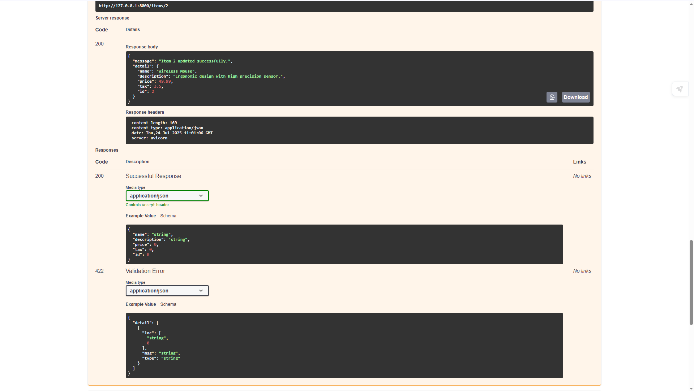

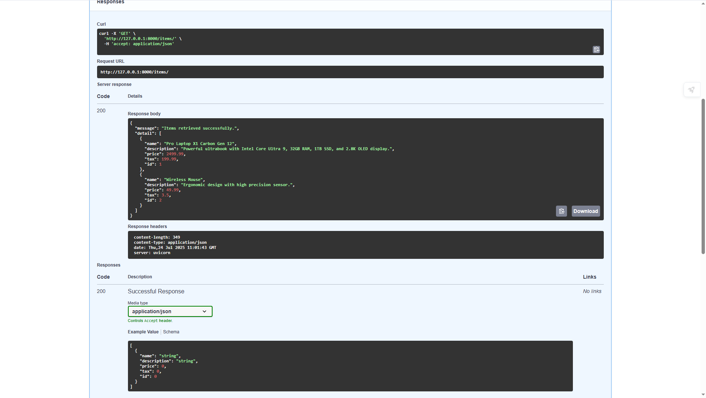

# Delete Request

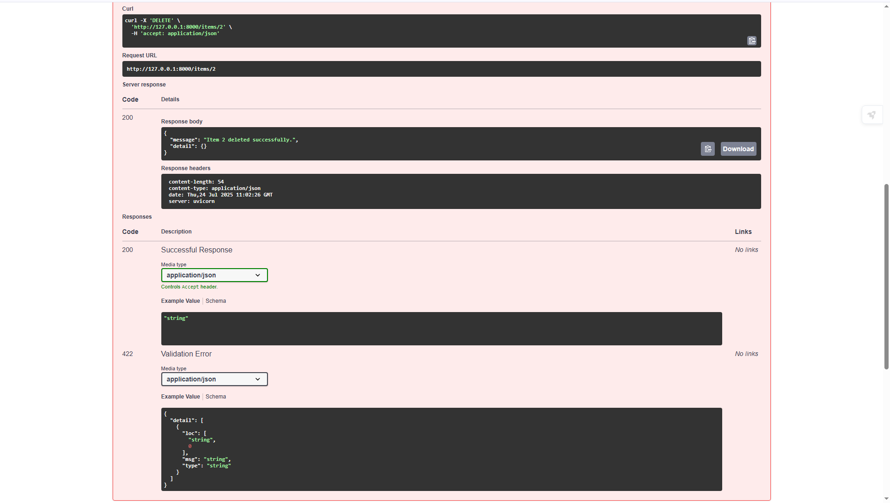


#### New Item created successfully

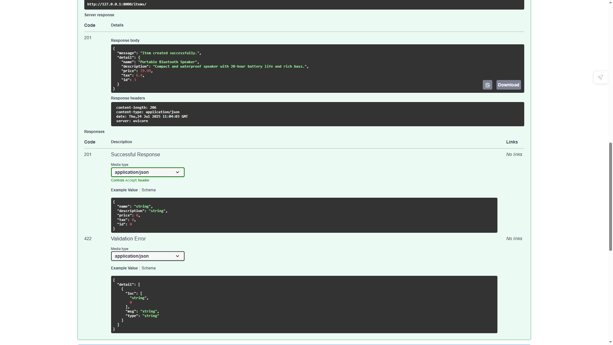

#### User API


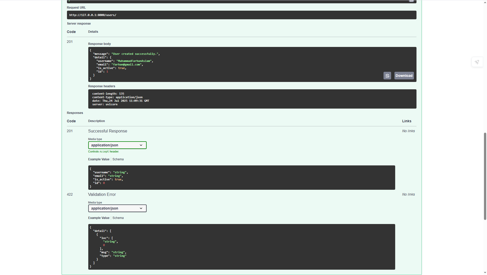


#### Retrieve user by id:

