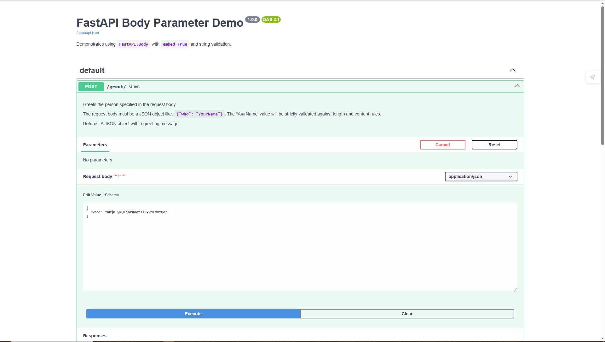

## Understanding `FastAPI.Body`: Defining Request Body Parameters

In modern web APIs, especially those following RESTful principles, data is often sent to the server in the **request body** for operations like creating new resources (`POST`) or updating existing ones (`PUT`/`PATCH`). FastAPI provides the `Body` dependency to clearly define and validate these parameters.

### What is `FastAPI.Body`?

`FastAPI.Body` is a special function (a "dependency") you use in your path operation function's parameters to explicitly tell FastAPI that a specific piece of data should come from the **request body**. It's part of FastAPI's powerful data validation, serialization, and documentation system.

### Why Use `Body`?

You use `Body` when:

1.  **You need to receive data in the request body:** This is the primary reason. Unlike path or query parameters (which are part of the URL), the request body allows sending more complex and larger data, typically in JSON format.
2.  **You want to add metadata for documentation:** `Body` allows you to add extra information like `title`, `description`, and `example` to your request body parameters. This metadata is then automatically included in the interactive API documentation (Swagger UI and ReDoc), making your API easier for others (or your future self) to understand and use.
3.  **You need to apply specific validation:** While Pydantic models handle most complex validation for request bodies, `Body` allows you to add validation directly to individual fields if they are primitive types (like `str`, `int`, `float`, `bool`).
4.  **You're receiving a single, primitive value in the body:** If your request body isn't a complex JSON object defined by a Pydantic model, but just a single string or number (e.g., the body is simply `"Hello"`), `Body` is how you declare it.

### Key Features and Usage

#### 1\. Defining a Request Body (Commonly with Pydantic Models)

The most common way to use a request body is with a Pydantic model. FastAPI automatically understands that if a parameter is type-hinted with a Pydantic model, it should expect a JSON body matching that model's schema.

```python
from pydantic import BaseModel
# ... (rest of imports)

class ItemCreate(BaseModel):
    name: str
    price: float

@app.post("/items/")
async def create_item(item: ItemCreate): # FastAPI infers 'item' comes from the request body
    return item
```

In this case, `Body` isn't strictly *needed* to define the body, as FastAPI infers it. However, you can still use `Body` here to add **metadata**:

```python
from fastapi import Body # <-- Import Body

@app.post("/items/")
async def create_item(
    item: ItemCreate = Body(
        ..., # Required
        title="Item to create",
        description="Provide details for the new item.",
        example={"name": "Book", "price": 19.99}
    )
):
    return item
```

This significantly enhances your API's documentation in `/docs`.

#### 2\. Handling Simple Values with `embed=True`

If your endpoint expects a single, primitive value (like just a string or an integer) as the *entire* request body, and you want it to be *embedded within a JSON object*, you use `Body` with `embed=True`.

**Example:**

```python
from fastapi import Body # <-- Import Body

@app.post("/greet/")
def greet(who: str = Body(embed=True, example="World")):
    """
    Expects a JSON body like: `{"who": "YourName"}`
    """
    return {"message": f"Hello, {who}!"}
```

  * **`who: str`**: Defines the parameter's type.
  * **`Body(...)`**: Tells FastAPI this parameter comes from the request body.
  * **`embed=True`**: This is crucial. It tells FastAPI to expect the value of `who` to be nested within a JSON object under the key `who`. If `embed=False` (the default) or omitted, FastAPI would expect the body to be just the raw string `"World"` directly, which is less common for JSON APIs.

#### 3\. Receiving Multiple Body Parameters (Advanced)

While less common and often better handled by a single Pydantic model, `Body` allows you to define multiple parameters that are *all* extracted from the request body. FastAPI will automatically combine these into a single dictionary.

```python
from fastapi import Body

@app.post("/login/")
async def login(username: str = Body(...), password: str = Body(...)):
    """
    Expects a JSON body like: `{"username": "user", "password": "pass"}`
    """
    return {"message": f"Login attempt for user: {username}"}
```

### `Body` vs. `Path` vs. `Query`

  * **`Path`**: Used for parameters that are part of the URL path itself (e.g., `/items/{item_id}`).
  * **`Query`**: Used for parameters that come after the `?` in the URL (e.g., `/items/?limit=10`).
  * **`Body`**: Used for data sent in the HTTP request's message body, typically for `POST`, `PUT`, or `PATCH` requests. This is where you send complex data structures like JSON objects.

