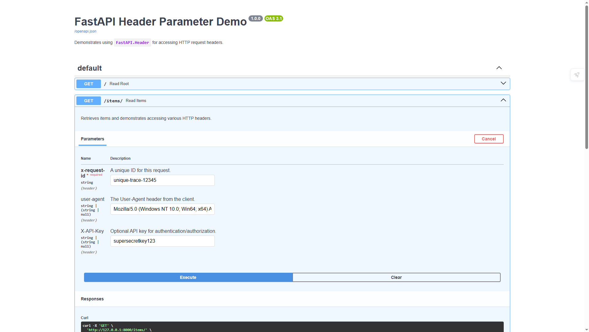
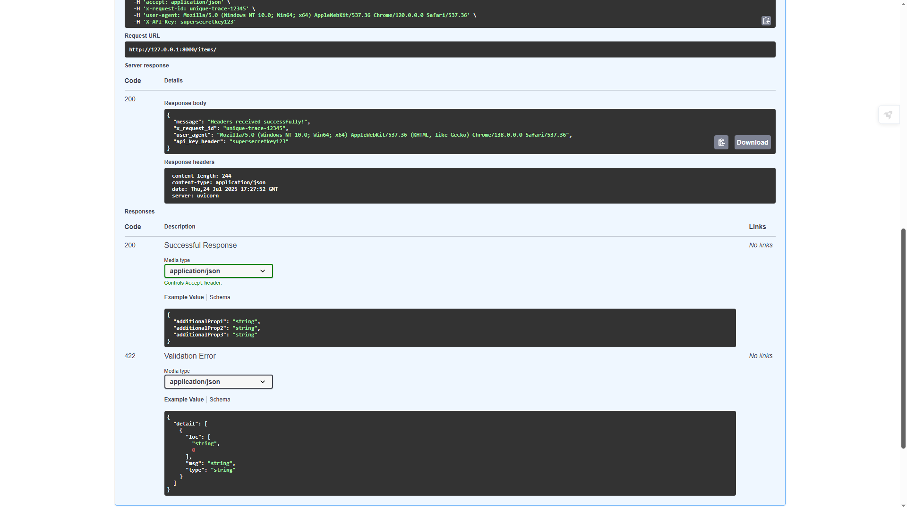

In FastAPI, the `Header` dependency allows you to define, validate, and access specific HTTP request headers sent by the client. This is crucial for functionalities like API key authentication, tracing (`X-Request-ID`), or client information (`User-Agent`).

## What is `FastAPI.Header`?

`FastAPI.Header` is a special function (a "dependency") used in your path operation function's parameters to declare that a parameter's value should be extracted from an HTTP request header. It functions similarly to `Query` and `Path` but targets the `Headers` section of the HTTP request.

## Why Use `Header`?

1.  **Access HTTP Headers:** Directly access standard or custom HTTP headers (e.g., `User-Agent`, `X-Request-ID`, `Authorization`).
2.  **Automatic Validation:** Leverage Pydantic's validation capabilities for header values (e.g., ensuring a header is a string, has a minimum length, or matches a specific pattern).
3.  **Automatic Documentation:** Headers you define with `Header` are automatically included in your OpenAPI (Swagger UI) documentation, clearly showing clients what headers are expected, if they are required, and providing examples.
4.  **Type Conversion:** FastAPI handles type conversion for header values (e.g., converting a header value like `"123"` to an `int` if type-hinted as `int`).
5.  **Clean Code:** Keeps header parsing and validation out of your core logic, making your endpoint functions cleaner.

## How to Use `Header`

You import `Header` from `fastapi` and then use it as the default value for a parameter in your path operation function.

### 1\. Defining a Required Header

To make a header mandatory, use `...` as its default value:

```python
from fastapi import Header

@app.get("/some-path/")
async def func(my_required_header: str = Header(...)):
    # ...
```

If the client doesn't send `My-Required-Header` (FastAPI converts snake\_case to kebab-case), a `422 Unprocessable Entity` error will be returned.

### 2\. Defining an Optional Header

To make a header optional, provide a default value (e.g., `None` for `Optional` types):

```python
from typing import Optional
from fastapi import Header

@app.get("/some-path/")
async def func(my_optional_header: Optional[str] = Header(None)):
    # ...
```

### 3\. Handling Header Names (Automatic Conversion & Aliasing)

HTTP header names are typically hyphen-separated (kebab-case), like `User-Agent` or `X-Request-ID`. Python variable names are snake\_case (`user_agent`, `x_request_id`).

  * **Automatic Conversion:** FastAPI automatically converts kebab-case header names to snake\_case for your Python variable if you define the variable name in snake\_case (e.g., `user_agent` will correctly match `User-Agent`).

  * **Aliasing with `alias`:** If you want your Python variable name to be completely different from the header name, or if the automatic conversion isn't what you need, use the `alias` parameter:

    ```python
    @app.get("/some-path/")
    async def func(api_key: str = Header(..., alias="X-API-Key")):
        # 'api_key' variable will get the value from the 'X-API-Key' header
        # ...
    ```

### 4\. Adding Metadata and Validation

Similar to `Query` and `Path`, `Header` allows you to add rich metadata for your documentation and apply validation rules:

  * `title`: A short title for the header in docs.
  * `description`: A longer description for the header.
  * `example`: An example value that will appear in Swagger UI.
  * `min_length`, `max_length`, `regex`: For string header values.
  * `ge`, `le`, etc.: For numeric header values.

**Example from `header.py`:**

```python
x_request_id: str = Header(
    ...,
    title="Request ID",
    description="A unique ID for this request.",
    example="trace-xyz-789"
)
```

## Running the Demo API

1.  **Save:** Save the code provided above as `header.py`.
2.  **Run:** Open your terminal in the directory and execute:
    ```bash
    uvicorn header:app --reload
    ```
    The API will be available at `http://127.0.0.1:8000`.

## Testing the API with Headers

You can test this API using `curl` or `HTTPie`, or directly through the interactive Swagger UI.

### 1\. Through Swagger UI (`/docs`)

Open your browser to `http://127.0.0.1:8000/docs`.

  * Expand the `GET /items/` endpoint.
  * Click "Try it out".
  * You will see fields for `x-request-id`, `user-agent`, and `X-API-Key` under the "Parameters" section. You can fill in the example values or your own.
  * Click "Execute" to send the request.

### 2\. Using `curl` (Command Line)

```bash
# Example 1: Sending only the required X-Request-Id header
curl -X GET "http://127.0.0.1:8000/items/" \
     -H "X-Request-Id: my-unique-id-123"

# Example 2: Sending all headers
curl -X GET "http://127.0.0.1:8000/items/" \
     -H "X-Request-Id: another-trace-abc" \
     -H "User-Agent: MyCustomClient/1.0" \
     -H "X-API-Key: mysecretkey"

# Example 3: Missing required X-Request-Id (will result in 422 Unprocessable Entity)
curl -X GET "http://127.0.0.1:8000/items/"

# Example 4: Invalid X-Request-Id (will result in 400 Bad Request due to endpoint logic)
curl -X GET "http://127.0.0.1:8000/items/" \
     -H "X-Request-Id: invalid"
```

### 3\. Using `HTTPie` (Command Line - Recommended for Readability)

If you have HTTPie installed (`pip install httpie`):

```bash
# Example 1: Sending only the required X-Request-Id header
http GET http://127.0.0.1:8000/items/ X-Request-Id:my-unique-id-123

# Example 2: Sending all headers
http GET http://127.0.0.1:8000/items/ \
     X-Request-Id:another-trace-abc \
     User-Agent:"MyCustomClient/1.0" \
     X-API-Key:mysecretkey

# Example 3: Missing required X-Request-Id (will result in 422)
http GET http://127.0.0.1:8000/items/
```



