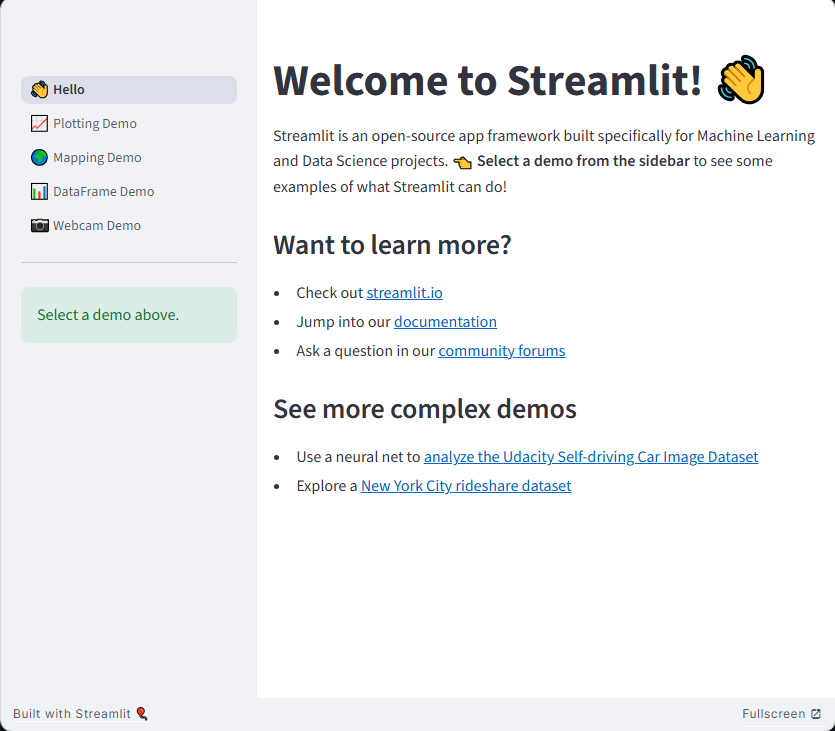

## 📄 `README.md`

- ##### Streamlit Documentation: https://docs.streamlit.io/
- ##### It supports `python version 3.9 to 3.13`.

 supports python version 3.9 to 3.13.

### Streamlit Hello World App

#### 🐍 1. Create a Conda Environment

Open your terminal and run:

```bash
conda create -n streamlit python=3.11 -y
```

#### 🐍 2. Activate the Environment
```
conda activate streamlit
```

#### 📦 3. Install Required Dependencies

```bash
pip install streamlit
```

#### Verify streamlit installation

```python
streamlit hello
```

#### 📝 4. Write Your First Hello World App

Create a new Python file named `hello.py`:

```bash
touch hello.py
```

Paste the following code into `hello.py`:

```python
import streamlit as st

st.title("Hello Streamlit")
st.write("👋 Hello World! Welcome to your first Streamlit app.")
```

#### 🚀 5. Run the Streamlit App

In your terminal, run:

```python
streamlit run hello.py
```

This will open your default browser with the running app.

#### ⚙️ Optional: Explore More Features

You can expand the app with additional Streamlit features like:

```python
st.text("This is plain text.")
st.markdown("## This is markdown")
st.code("print('Hello World')")
```

Try editing your `hello.py` and re-running `streamlit run hello.py` to see the changes.

* To stop the app, press `Ctrl+C` in your terminal.
* Streamlit auto-updates when you save your file.
* You can build powerful dashboards, ML apps, and data visualizations using Streamlit.


