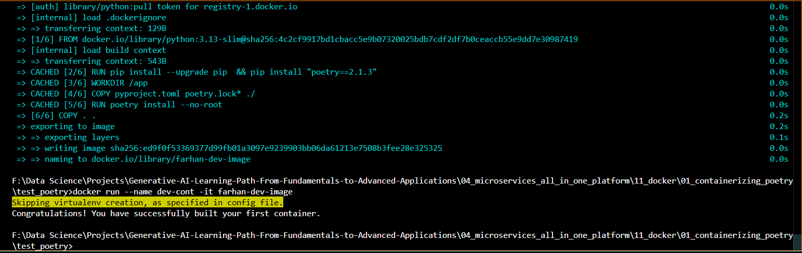

## 📝 Poetry v2.x+ Environment Activation Guide (Windows)

### 📌 Prerequisite

Ensure you have **Poetry installed**:

```bash
poetry --version
```

You should see something like:

```
Poetry (version 1.8.x or 2.x.x)
```

---

### ⚙️ Step 1: Create or Navigate to Your Project

```bash
cd path\to\your\project
```

If you haven't already initialized a project:

```bash
poetry init
```

Install dependencies or just install the environment:

```bash
poetry install
```

---

### 🔍 Step 2: Check Virtual Environment Info

```bash
poetry env info
```

This shows details like:

* Python version
* Virtualenv path
* Executable location

Example output:

```
Path: C:\Users\<User>\AppData\Local\pypoetry\Cache\virtualenvs\<env-name>
```

---

### ✅ Step 3: Activating the Virtual Environment

#### Option 1: **Use `poetry env activate` (Recommended in Poetry v2)**

```bash
poetry env activate
```

You'll get a path like:

```
C:\Users\<User>\AppData\Local\pypoetry\Cache\virtualenvs\<env-name>\Scripts\activate.bat
```

👉 **Run this command manually:**

```bash
call "C:\Users\<User>\AppData\Local\pypoetry\Cache\virtualenvs\<env-name>\Scripts\activate.bat"
```

This will activate the virtual environment in your terminal session.

---

#### Option 2: **Restore `poetry shell` via Plugin (Optional)**

By default, `poetry shell` is not available in v2.x. To use it:

```bash
poetry self add poetry-plugin-shell
```

Then simply activate the environment using:

```bash
poetry shell
```

---

### 🧪 Step 4: Confirm Activation

You can verify you're in the Poetry environment by checking:

```bash
where python
```

It should point to the Poetry virtualenv path.

Or:

```bash
python --version
```

---

### 🧹 Step 5: Deactivate the Environment

To deactivate:

```bash
deactivate
```


#### After running container

