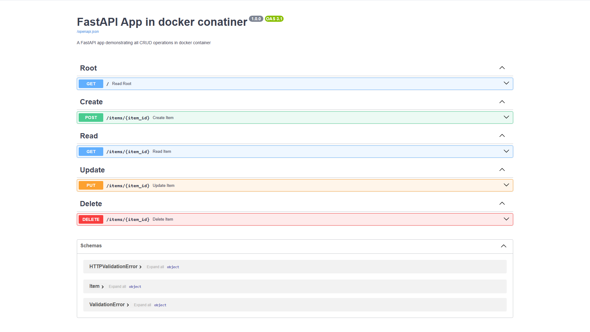
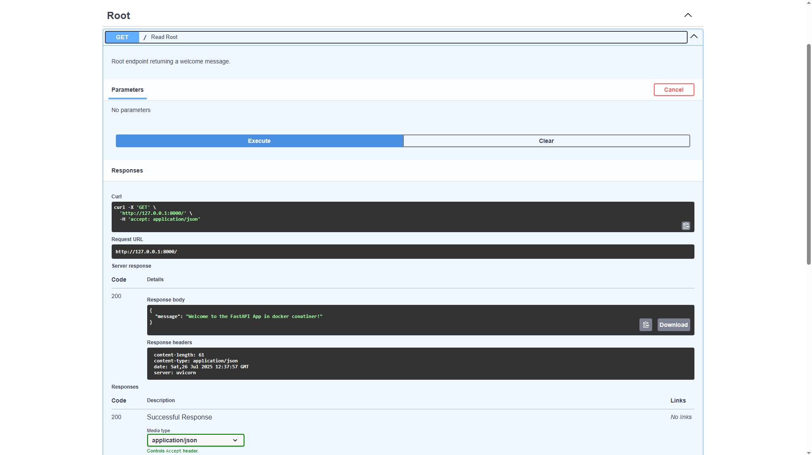
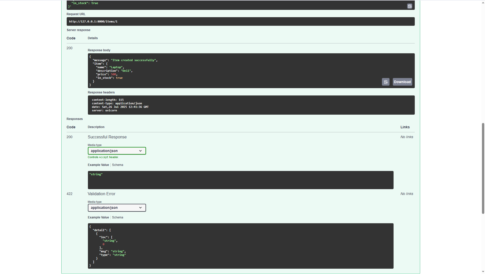
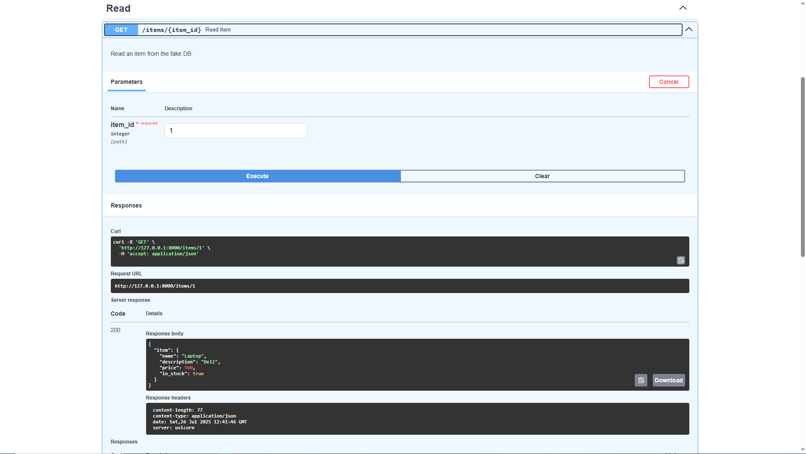
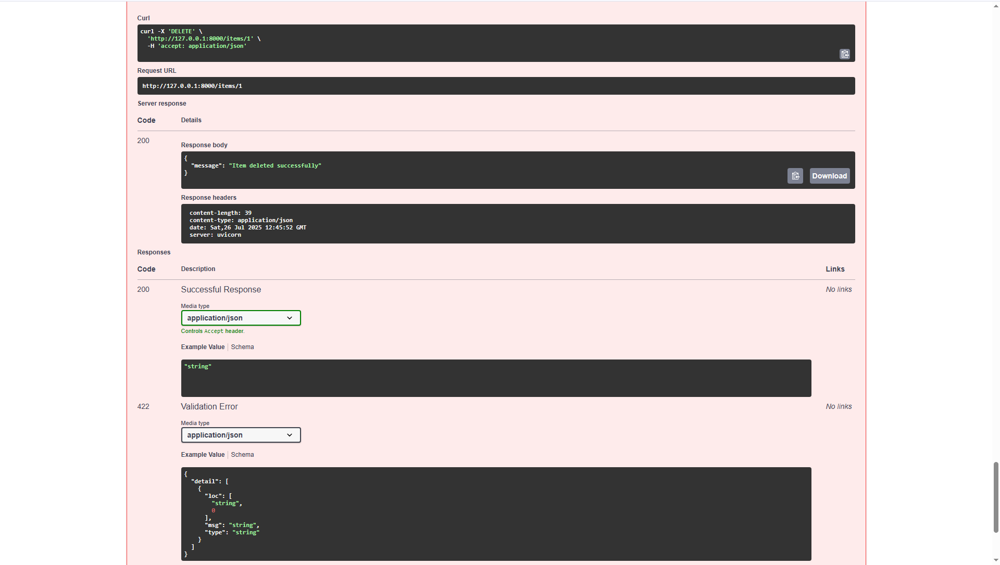

# Containerizing the API

We will take the microservice created in step10_poetry_project and containerize it.

## Let's First Run the app without Docker to test if everything is working

We have updated our toml file using this as a base:

https://github.com/tiangolo/full-stack-fastapi-template/blob/master/backend/pyproject.toml

Note: Review each and every dependency in the toml file. So that you learn what are the different libraries used in development.

Install dependency:

    poetry install

Run project in Poetry Envirnoment, to see if it is running outside a container:

    poetry run uvicorn app.main:app --host 0.0.0.0 --port 8000

Open in Browser:

    http://0.0.0.0:8000/

    http://0.0.0.0:8000/docs

    http://0.0.0.0:8000/openapi.json

Run test:

    poetry run pytest


## Now Let's Containerize the App

https://fastapi.tiangolo.com/deployment/docker/

**Checking to see if Docker is running:**

```bash
docker version
```

**Building the Image for Dev:**

```bash
docker build -f Dockerfile.dev -t my-dev-image .
```

**Check Images:**

```bash
docker images
```

**Verify the config:**

```bash
docker inspect my-dev-image
```

**Running the Container for Dev:**

https://docs.docker.com/engine/reference/run/

```bash
docker run -d --name dev-cont1 -p 8000:8000 my-dev-image
```

**Check in browser:**

http://localhost:8000

**container logs**
```bash
docker logs dev-cont1
```

<!-- **container logs: To follow only new log files you can use -f --since 0m  --tail 10**
```bash
docker logs dev-cont1 -f
docker logs dev-cont1 -f --tail 10
docker logs dev-cont1 -f --since 10m
``` -->

**Test the Container:**

```bash
docker run -it --rm my-dev-image /bin/bash -c "poetry run pytest"
```

**List Running Containers**

```bash
docker ps
```

**List all Containers**

```bash
docker ps -a
```

**Intract with the Container:**

```bash
docker exec -it dev-cont1 /bin/bash
```

**Exit from the container shell**
```bash
exit
```

## Building fully optimized production images for Kubernetes or serverless cloud environments:**

Docker Image with Poetry

If you use Poetry to manage your project's dependencies, you could use Docker multi-stage building:

https://fastapi.tiangolo.com/deployment/docker/

**Building fully optimized Image for Production:**

```bash
docker build -f Dockerfile.prod -t my-prod-image-optimized .
```

**Running the Container for Production:**

```bash
docker run -d -p 8000:8000 my-prod-image-optimized
```

Additional References:

https://www.jeffastor.com/blog/testing-fastapi-endpoints-with-docker-and-pytest/

## After docker container is up


# Swagger UI










