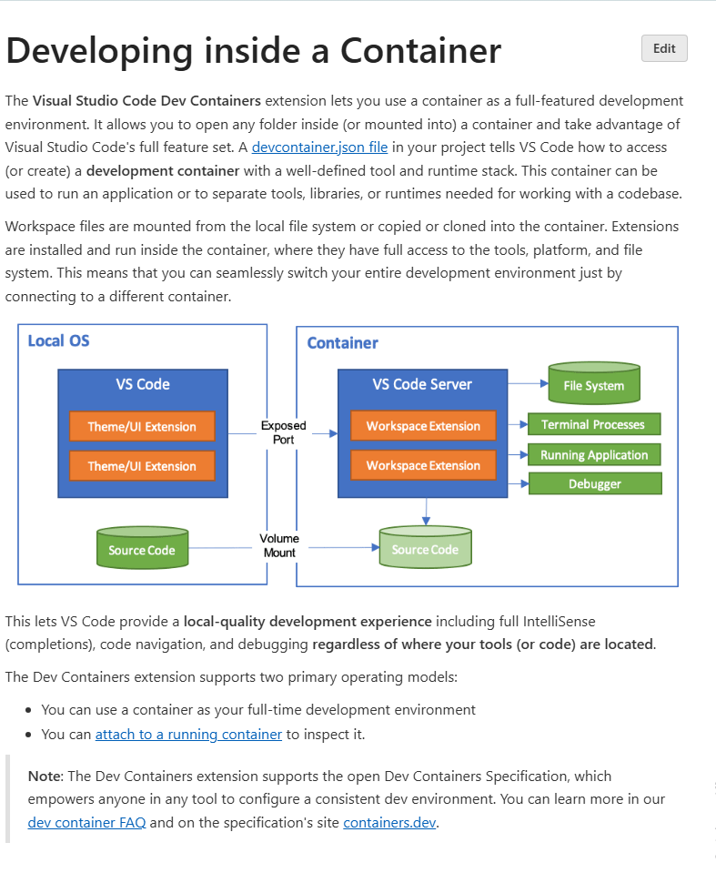

# Developing inside a Container

**Docker Dev Containers: A Powerful Paradigm for Consistent, Efficient, and Seamless Development**

In the fast-paced world of software development, achieving a consistent and reproducible development environment across a team has long been a holy grail. The notorious "it works on my machine" syndrome, coupled with tedious setup processes for new team members and constant environment drift, has historically plagued projects. Enter **Docker Dev Containers** – a transformative approach that leverages the power of containerization to provide isolated, consistent, and highly efficient development workspaces.

### What are Docker Dev Containers?

At its core, a Docker Dev Container is a **Docker container specifically configured to serve as your complete development environment**. Instead of installing all your project's programming languages, SDKs, tools, and dependencies directly onto your local machine, you define them within a Docker image. When you start developing, your Integrated Development Environment (IDE) or editor connects to and operates within this container.

These containers encapsulate everything a project needs:

* **Operating System:** A specific Linux distribution (e.g., Debian, Ubuntu, Alpine).
* **Language Runtimes and SDKs:** Exact versions of Python, Node.js, Java, Go, Ruby, .NET, etc.
* **Development Tools:** Compilers, build systems (npm, pip, Maven, Gradle), linters, formatters, debuggers, version control tools (Git).
* **Project Dependencies:** All libraries and packages required by your application.
* **IDE/Editor Configurations:** Often, specific editor extensions and settings are automatically installed and applied within the container environment.

The blueprint for a dev container is typically defined in a special `.devcontainer` directory within your project's repository. This directory usually contains:

* **`devcontainer.json`:** The primary configuration file, specifying the base Docker image or `Dockerfile` to use, ports to forward, environment variables, post-create commands, and even editor-specific settings.
* **`Dockerfile` (optional, but common):** A standard Dockerfile used to build the custom image for the development environment, allowing for more complex installations and configurations beyond a simple base image.

### The Problem They Solve: "Works On My Machine" No More

Traditional development workflows often lead to:

1.  **Inconsistent Environments:** Different OSes, varying tool versions, or locally installed conflicting dependencies lead to subtle bugs that only appear on specific machines.
2.  **Tedious Onboarding:** Setting up a new developer can take hours or even days, involving manual installation of numerous tools and troubleshooting version conflicts.
3.  **Environment Drift:** Over time, local machines accumulate global packages and tools, making it difficult to maintain a clean, project-specific environment.
4.  **Debugging Discrepancies:** Issues that arise might be due to environmental differences rather than actual code bugs, wasting valuable development time.

Dev containers systematically address these challenges by providing a controlled, reproducible environment for every developer.

### How Dev Containers Work (Including Live Changes)

The process typically unfolds as follows:

1.  **Configuration:** You define your desired development environment in `devcontainer.json` and a potentially referenced `Dockerfile`. This configuration becomes part of your project's version control.
2.  **Container Spin-Up:** When you open your project in a compatible IDE (like VS Code with the Dev Containers extension), the IDE reads the `.devcontainer` configuration. It then instructs Docker to build (if necessary) or pull the specified image and create a new container instance.
3.  **Code Mounting & IDE Attachment:** Crucially, your local project's code directory is **volume-mounted** directly into the running container. This is the key to enabling live changes. Your IDE then "attaches" to this running container. From this point forward, all your operations – running terminal commands, executing code, debugging, and installing packages – happen *inside* the container.

    **Seamless Live Changes:**
    Because your local code is mounted into the container, any change you save in your host machine's IDE is **immediately reflected inside the container**. This allows for natural development workflows, including:
    * **Hot-reloading:** If you're using development servers with hot-reloading capabilities (e.g., `uvicorn --reload` for FastAPI, `nodemon` for Node.js, `webpack-dev-server` for front-end apps), these tools running *inside* the container will detect your host-side code changes and automatically reload the application or inject the changes, just as they would in a traditional local setup.
    * **Instant Feedback:** You get instant feedback on your code modifications without needing to manually copy files or restart the container.

4.  **Development Workflow:** You interact with your code as if it were local, but the execution context is entirely within the isolated container.

### Key Benefits of Docker Dev Containers

1.  **Unrivaled Consistency:** Guarantees that every developer on the team works with the exact same operating system, language versions, toolchains, and dependencies. This eradicates "works on my machine" issues.
2.  **True Isolation:** Provides a clean, isolated environment for each project. You can work on multiple projects with conflicting dependencies without cluttering your host machine or causing conflicts.
3.  **Accelerated Onboarding:** New team members can become productive in minutes, not days. They simply clone the repository and let the dev container configuration set up their entire environment automatically.
4.  **Reproducibility:** Since the environment is defined as code (in `devcontainer.json` and `Dockerfile`), it's completely reproducible. You can always recreate the exact development environment at any point in time.
5.  **Enhanced Portability:** Dev containers work seamlessly across different host operating systems (Windows, macOS, Linux). This also extends to cloud-based development environments, where the container runs on a remote server (e.g., GitHub Codespaces).
6.  **Simplified Toolchain Management:** Developers no longer need to manually install and manage complex SDKs, compilers, or multiple versions of runtimes on their local machines. Docker handles it all.
7.  **Seamless Live Changes:** As explained, the volume mounting mechanism ensures that code changes made on your host machine are immediately available and actionable within the container, enabling efficient iterative development with hot-reloading capabilities.
8.  **Security:** By isolating development tools within a container, you reduce the attack surface on your host machine.

### Common Use Cases and Ecosystem

Dev containers are incredibly versatile and suitable for almost any tech stack:

* **Python:** Develop Flask/FastAPI apps, data science projects, or machine learning models.
* **Node.js:** Build backend APIs with Express or front-end apps with React/Vue/Angular.
* **Java:** Work on Spring Boot applications or other JVM-based projects.
* **Go:** Develop high-performance services.
* **IoT/Embedded:** Test code against specific ARM architectures or environments.

The most prominent tool in the dev container ecosystem is **Visual Studio Code (VS Code)**, which offers robust integration through its "Dev Containers" extension. Other platforms like **GitHub Codespaces** and **Gitpod** are built entirely on the dev container specification, providing cloud-hosted, on-demand development environments. JetBrains IDEs (IntelliJ IDEA, PyCharm, etc.) also offer increasing support for connecting to development containers.

### Considerations

While powerful, dev containers do have a few considerations:

* **Initial Setup:** Defining the `devcontainer.json` and `Dockerfile` requires some initial learning and configuration.
* **Resource Usage:** Running Docker containers consumes host machine resources (CPU, RAM, disk space), though usually less than a full VM.
* **File System Performance:** On some operating systems (particularly Windows with WSL1 or older Docker Desktop versions), file system performance for mounted volumes could be a bottleneck, though this has vastly improved with WSL2.

### Conclusion

Docker Dev Containers represent a significant leap forward in developer experience. By standardizing development environments as code, they eliminate "works on my machine" issues, streamline onboarding, ensure consistency, and allow developers to focus on writing code rather than wrestling with environmental setups. The ability to make live changes directly from your host IDE, with immediate reflection within the container, makes this paradigm not just consistent but also incredibly efficient and seamless for modern development workflows.

- https://code.visualstudio.com/docs/devcontainers/containers

- https://code.visualstudio.com/docs/devcontainers/tutorial
