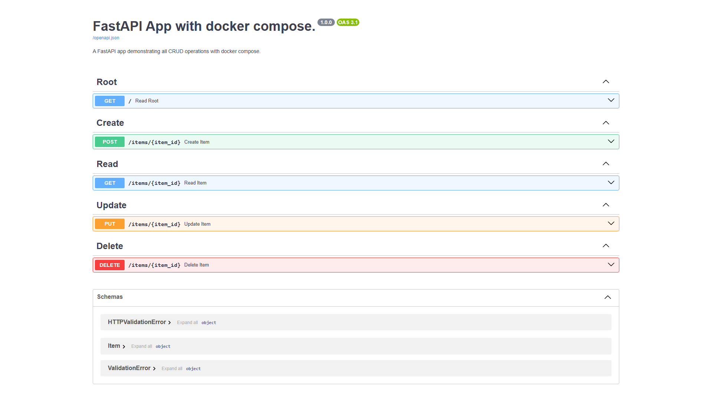
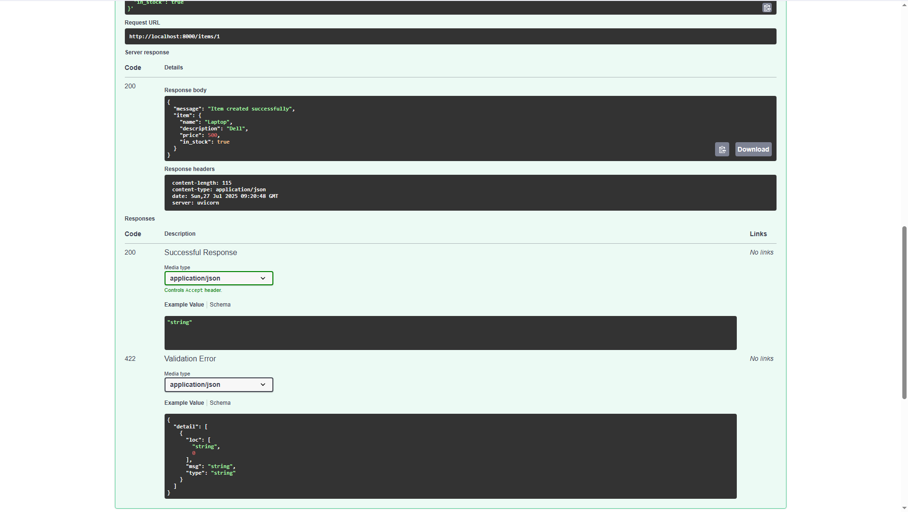
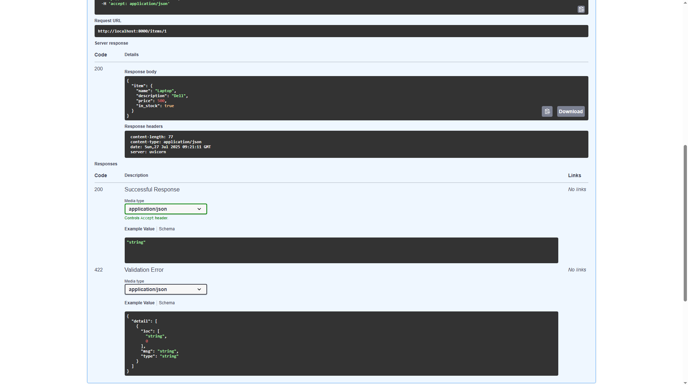
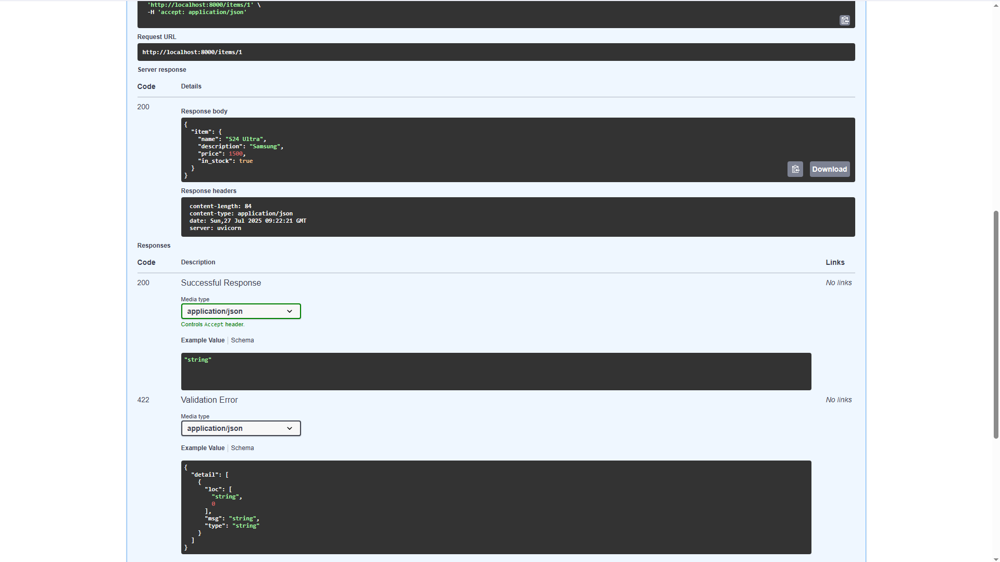
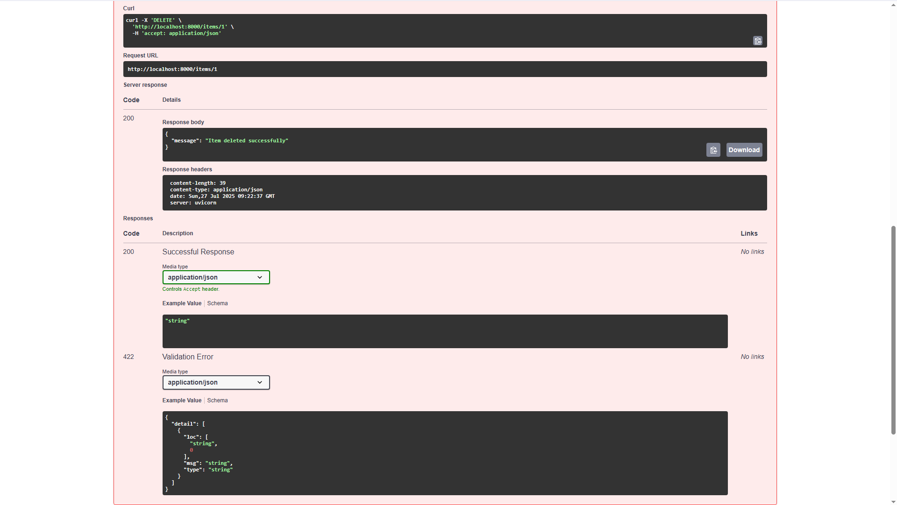

## 🐳 Docker Compose CLI Commands

#### Start & Run Containers

```bash
docker-compose up                     # Start all services (foreground)
docker-compose up -d                  # Start in detached mode (background)
docker-compose up --build             # Force rebuild and start
docker-compose up --no-deps app       # Start only "app" service (no deps)
```

#### Stop & Remove Containers

```bash
docker-compose down                              # Stop + remove containers + network
docker-compose down -v                           # Also remove volumes
docker-compose down --rmi all                    # Also remove built images
docker-compose down --remove-orphans             # Remove containers not in current file
```

#### Restart / Control

```bash
docker-compose stop                              # Stop services (keep containers)
docker-compose start                             # Restart stopped containers
docker-compose restart                           # Restart all containers
docker-compose restart <service>                 # Restart a specific service
```

#### Logs & Debugging

```bash
docker-compose logs                              # Show logs from all services
docker-compose logs -f                           # Follow logs live (tail -f style)
docker-compose logs -f --tail=100 <service>      # Last 100 lines of a service
```

#### Container Access

```bash
docker-compose ps                                # List running containers
docker-compose exec app bash                     # Shell inside "app" container
docker-compose exec db psql -U postgres          # Connect to Postgres
```

#### Build & Clean

```bash
docker-compose build                             # Build all services
docker-compose build --no-cache                  # Clean build without cache
docker system prune -a                           # Remove all unused Docker data
docker volume prune                              # Remove dangling volumes
```
---
## 📄 docker-compose.yml Structure Guide

### Basic Template

```yaml
version: '3.9'

services:
  app:
    build:
      context: .
      dockerfile: Dockerfile.dev
    command: poetry run uvicorn src.main:app --host 0.0.0.0 --port 8000 --reload
    ports:
      - "8000:8000"
    volumes:
      - .:/app
    depends_on:
      - db

  db:
    image: postgres:15
    environment:
      POSTGRES_USER: admin
      POSTGRES_PASSWORD: secret
      POSTGRES_DB: fastapi_db
    volumes:
      - db_data:/var/lib/postgresql/data
    ports:
      - "5432:5432"

volumes:
  db_data:
```
---

## 🧾 docker-compose.yml Section Breakdown

### `services`

Defines each container (API, DB, Redis etc).

```yaml
services:
  app:
    image: ...
```

---

### `build`

Tell Docker how to build an image.

```yaml
build:
  context: .
  dockerfile: Dockerfile.dev
```

---

### `command`

Override default CMD of Dockerfile.

```yaml
command: poetry run uvicorn main:app --reload
```

---

### `ports`

Map host ports to container ports.

```yaml
ports:
  - "8000:8000"
```

---

### `volumes`

Mount host folders inside containers (for live reload).

```yaml
volumes:
  - .:/app
```

---

### `depends_on`

Control start order between containers.

```yaml
depends_on:
  - db
```

---

### `environment`

Set environment variables inside container.

```yaml
environment:
  - POSTGRES_DB=mydb
  - POSTGRES_USER=user
  - POSTGRES_PASSWORD=pass
```

---

### `volumes:` (Global)

Define named volumes to persist data across restarts.

```yaml
volumes:
  db_data:
```

---

### .env File Example (Optional)

`.env` file:

```env
POSTGRES_USER=admin
POSTGRES_PASSWORD=secret
```

And in `docker-compose.yml`:

```yaml
environment:
  - POSTGRES_USER=${POSTGRES_USER}
```

---

### Recommended Project Structure

```
.
├── docker-compose.yml
├── Dockerfile.dev
├── .env
├── pyproject.toml
├── poetry.lock
├── src/
│   └── main.py
├── tests/
```

---

# Swagger UI












