## FastAPI + Postgresql

- https://www.datacamp.com/tutorial/postgresql-docker

- https://medium.com/@basit26374/how-to-run-postgresql-in-docker-container-with-volume-bound-c141f94e4c5a

#### Logs

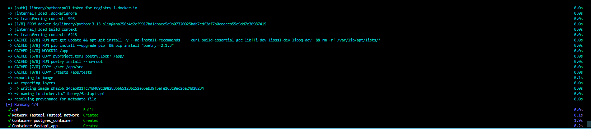

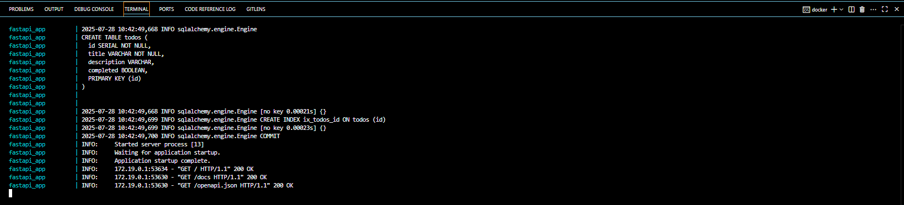

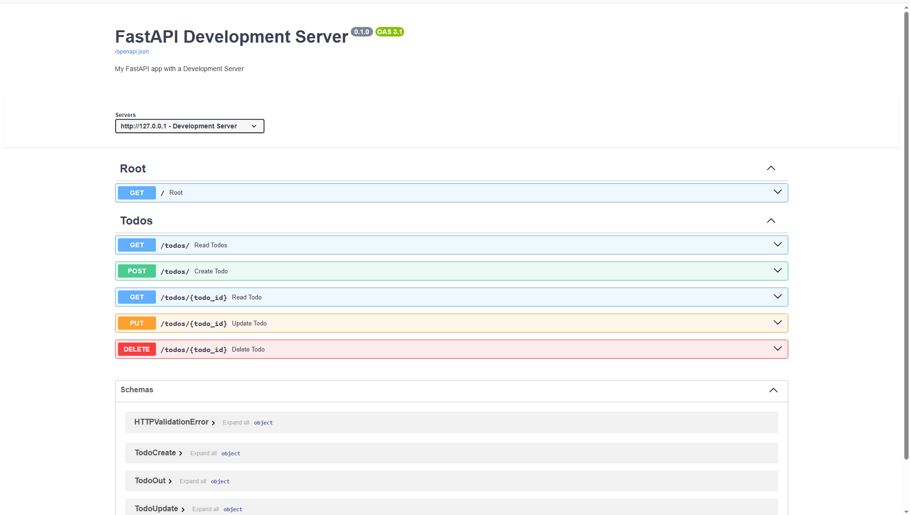

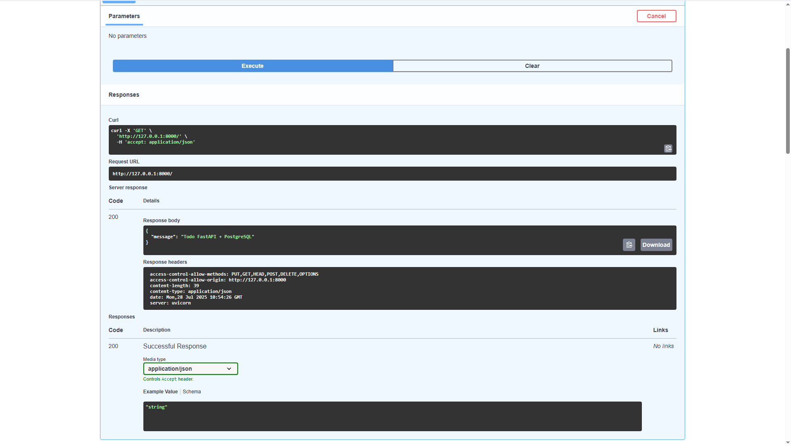

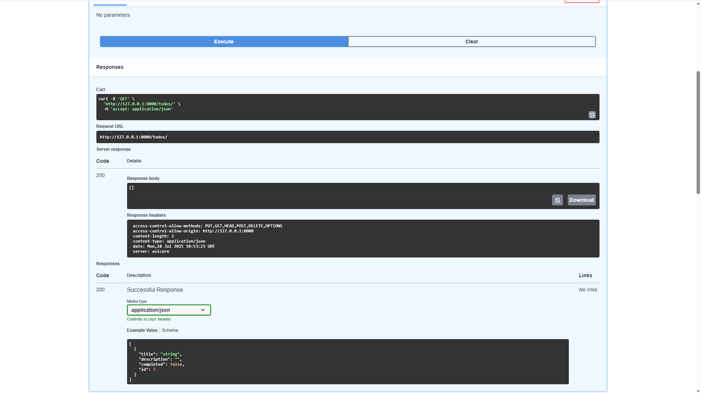

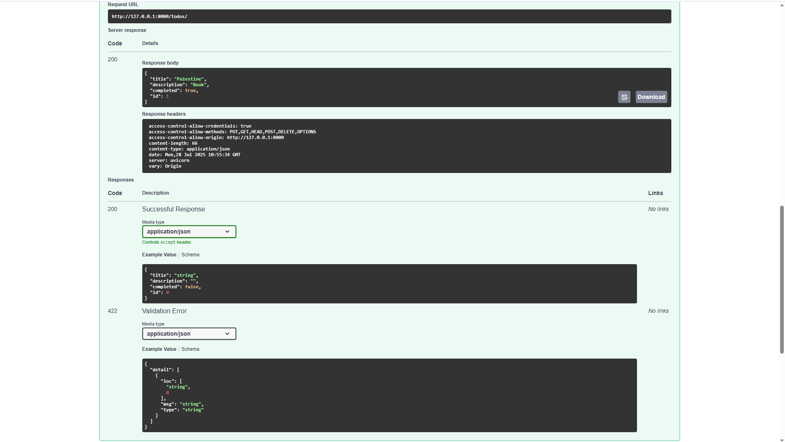

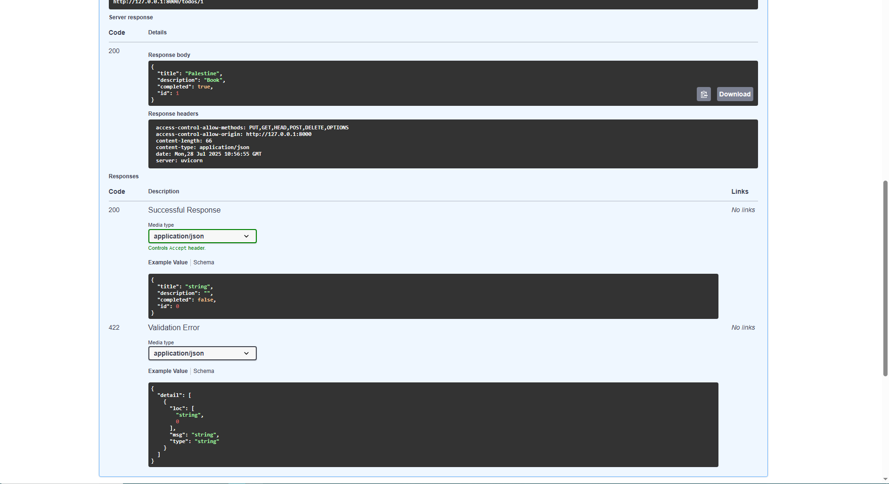

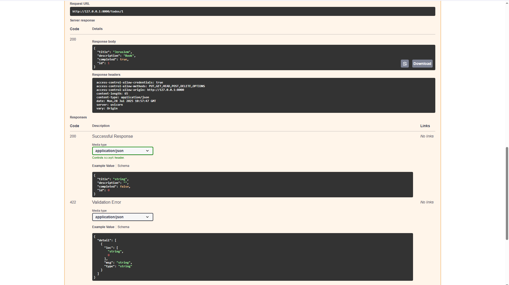

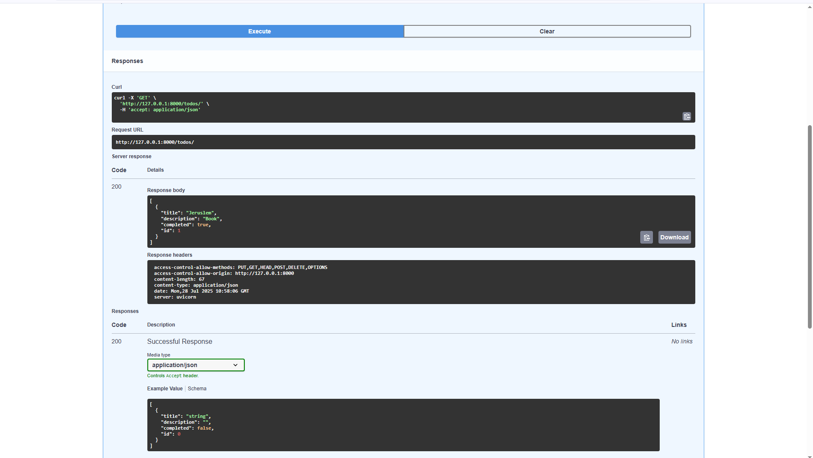

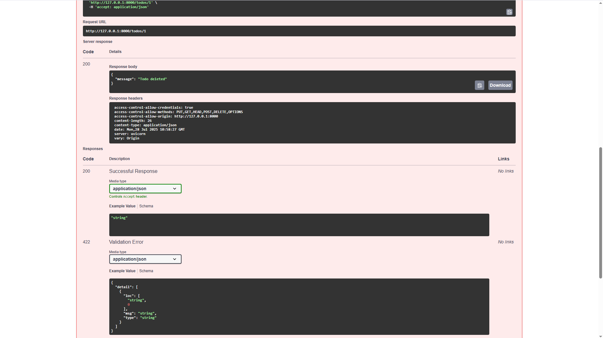

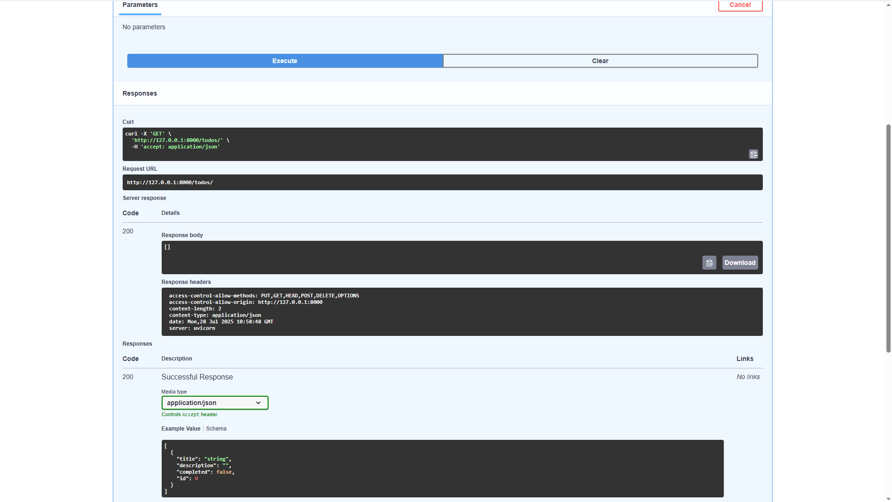