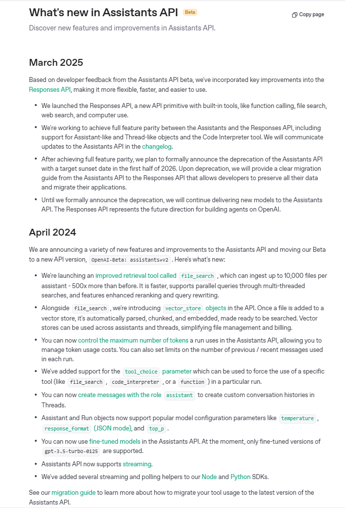

## OpenAI Assistants API: Empowering Context-Aware and Actionable AI in Your Applications

The OpenAI Assistants API marks a significant evolution in building sophisticated AI applications, moving beyond stateless conversational models to create intelligent, persistent, and tool-augmented AI agents. Designed to simplify the complexities of managing conversation state, integrating tools, and handling code execution, the Assistants API provides a robust framework for developers to embed powerful AI capabilities directly into their products.

### **What is the Assistants API?**

The OpenAI Assistants API allows developers to construct **AI assistants** tailored to specific instructions and equipped with the ability to leverage various tools, models, and files to effectively respond to user queries. Unlike the stateless nature of the Chat Completions API, the Assistants API is **stateful**, meaning it inherently manages conversation history, tool definitions, retrieval documents, and code execution environments. This persistence greatly simplifies the development of complex AI applications by abstracting away much of the underlying infrastructure required for continuous, multi-turn interactions.

### **Core Components and Workflow**

The architecture of the Assistants API is built around three fundamental components that orchestrate the AI's behavior and interaction:

* **Assistants**: These are the central AI entities you define. An Assistant encapsulates a base model (e.g., GPT-4, GPT-3.5 Turbo), a set of specific **instructions** that guide its behavior and personality, and a collection of **tools** it can utilize. Assistants can also be configured with context documents, allowing them to draw on specific knowledge bases.
* **Threads**: A Thread represents a single, continuous conversation session between a user and an Assistant. It stores the entire message history, automatically handling message truncation to fit the model's context length. This persistence allows the AI to maintain context across multiple user turns without requiring developers to manage the conversation state manually.
* **Runs**: A Run is an execution instance of an Assistant on a particular Thread. When you create a Run, you prompt the Assistant to process the messages within the Thread and take action based on its instructions and available tools. Runs are asynchronous operations, meaning your application can poll their status to determine when the Assistant has completed its processing, whether by generating a textual response or executing a tool.

The typical workflow for interacting with the Assistants API involves:

1.  **Creating an Assistant:** Defining its instructions, chosen model, and the tools it can access.
2.  **Creating a Thread:** Initiating a new conversation session.
3.  **Adding Messages to the Thread:** User queries are appended to the Thread.
4.  **Creating a Run:** Triggering the Assistant to process the Thread's content.
5.  **Polling the Run Status:** Monitoring the Run until it completes or requires action.
6.  **Displaying Assistant Responses:** Presenting the generated text or executing required actions.

### **Powerful Integrated Tools**

A cornerstone of the Assistants API's power is its native support for diverse tools, allowing Assistants to perform actions far beyond mere text generation:

* **Code Interpreter**: This built-in tool enables Assistants to write and execute Python code in a sandboxed environment. This is invaluable for tasks requiring mathematical computations, data analysis, or logical problem-solving, such as calculating Fibonacci numbers or processing complex financial data.
* **File Search**: Formerly known as "Retrieval," this tool allows Assistants to search over documents and files you provide. It is ideal for grounding responses in specific knowledge bases, reducing hallucinations, and ensuring accuracy when dealing with large volumes of information like internal company policies, product documentation, or research papers. Assistants can access and create files in various formats and cite referenced files in their generated messages.
* **Function Calling**: This highly flexible tool empowers Assistants to interact with external systems, APIs, or custom business logic. You define the schema for custom functions (e.g., `get_account_balance`, `initiate_transfer`), and the Assistant intelligently determines when to "call" one of these functions, extracting the necessary arguments from the user's natural language input. When a custom function is called, the Run status changes to `requires_action`, signaling your application to execute the actual function in your backend system and then provide the output back to the Assistant for further processing and response generation. This capability is crucial for enabling real-time data retrieval and transactional actions.

    **Real-Life Analogy: The Intelligent Personal Assistant with a Rolodex of Experts** 

    Imagine you have a highly intelligent **Personal Assistant** (this is your **LLM**). This Assistant is brilliant at understanding your requests and speaking eloquently. However, they don't have all the answers or abilities themselves.

    Now, imagine this Assistant also has a **Rolodex** (this is your **defined functions/tools**). On each card in the Rolodex, there's a name like "Weather Forecaster ," "Bank Teller ," or "Flight Booker ." Each card also clearly states what information that "expert" needs to do their job (e.g., the Weather Forecaster needs a `location`, the Bank Teller needs an `account_number`).

    When you tell your Assistant, "What's the weather in London?", the Assistant doesn't *know* the weather itself. Instead, it looks at its Rolodex, finds the "Weather Forecaster" card, understands that it needs a `location`, and then confidently tells *you* (the **application layer**): "I need to ask the Weather Forecaster about 'London'."

    You, the application, then pick up the phone, call the *actual* Weather API (the **real Weather Forecaster**), give it "London," and get the current weather. You then relay that information back to your Assistant.

    Finally, your Assistant, now armed with the real-time weather data, eloquently tells you: "The weather in London is currently 15°C and partly cloudy."

    In this analogy:
    * **Your Personal Assistant (LLM)**: Understands your intent and knows *who* to call (which function).
    * **The Rolodex (Function Schema)**: Defines the available experts (functions) and what they need (parameters).
    * **You (Application Layer)**: The trusted intermediary who *actually* makes the call to the expert and gets the real data securely.
    * **The Experts (External APIs/Databases)**: The secure systems holding the real-time or sensitive data, or performing the actual actions.

    The LLM never directly talks to the Weather API or your bank's database; it only knows *about* them and tells your application to interact with them securely. This separation is key to security and functionality.

Assistants are capable of utilizing multiple tools in parallel, including both OpenAI's built-in offerings and your custom function-based tools, leading to highly dynamic and capable AI applications.

### **Security and Persistence Considerations**

The stateful nature of the Assistants API, particularly with persistent Threads, simplifies development by handling message history. For sensitive applications, such as those in banking, the use of **Function Calling** is paramount for data security. The LLM itself never directly accesses or stores sensitive data; it only outputs a structured request to call a predefined function. Your secure backend application then intercepts this request, performs the necessary authentication and authorization, executes the function against your secure databases, and only then provides the non-sensitive *result* back to the LLM for response generation. This architecture ensures that sensitive customer information remains within your secure environment, adhering to stringent privacy and compliance regulations.

### **Getting Started**

To begin building with the Assistants API, ensure your OpenAI Python SDK is updated to the latest version. You can either create and manage Assistants via the [Assistants Playground](https://platform.openai.com/assistants) for initial experimentation or directly through the API for programmatic control. The [OpenAI Cookbook Assistants API Overview](https://cookbook.openai.com/examples/assistants_api_overview_python) provides practical Python examples to guide you through setting up Assistants, Threads, and Runs, and integrating various tools.

The Assistants API, currently in beta and under continuous development, represents a robust foundation for creating highly capable, context-aware, and actionable AI assistants that can seamlessly integrate with your existing applications and data infrastructure. 

## Assistants API: Unlocking Computational Power with Code Interpreter

The OpenAI Assistants API's **Code Interpreter** tool is a game-changer, providing Large Language Models (LLMs) with the ability to write and execute Python code within a secure, sandboxed environment. This transforms LLMs from purely generative text models into powerful analytical and problem-solving engines, capable of handling complex computations, data analysis, and even generating visual outputs.

---

### **What is Code Interpreter?**

Code Interpreter allows an Assistant to **programmatically reason** and **perform calculations** by generating and running Python code. When enabled, the LLM can decide, based on the user's request and its internal instructions, that a coding task is necessary. It then writes the Python code, executes it in a private environment, and receives the output back. If the code fails, the Assistant can iteratively debug and rewrite the code until it achieves a successful execution, mimicking a human programmer's problem-solving process.

---

### **How it Works: A Simplified Process**

1.  **Enable Code Interpreter:** You enable Code Interpreter when creating or updating an Assistant by specifying `{"type": "code_interpreter"}` in its `tools` parameter.
2.  **User Query:** A user poses a query that requires computational or data-driven reasoning (e.g., "Analyze this sales data and tell me the quarterly growth," or "What's the square root of 12345?").
3.  **LLM Decides to Code:** The Assistant, guided by its instructions and the query's nature, determines that it needs to write and execute code. It formulates a Python script to address the problem.
4.  **Code Execution (Sandboxed):** The generated Python code is sent to a secure, isolated execution environment. This sandbox prevents the code from interacting with external systems or your infrastructure, ensuring security.
5.  **Output and Iteration:** The Assistant receives the output of the code execution, which could be a numerical result, a data table, an error message, or even a generated file (e.g., a CSV, an image of a graph). If an error occurs, the Assistant can use this feedback to modify and re-run its code, iterating until the task is successfully completed.
6.  **Formulate Response:** Based on the code's successful output, the Assistant then synthesizes a natural language response to the user.

---

### **Key Capabilities and Features**

* **Mathematical and Logical Problem Solving:** Excels at complex calculations, algebraic problems, and logical deductions that go beyond simple arithmetic.
* **Data Analysis and Manipulation:** Can process various file types (e.g., CSV, JSON, PDF, TXT) to perform statistical analysis, identify trends, clean data, and derive insights.
* **File Handling:**
    * **Input:** Users can upload files (e.g., a `.csv` file of sales data) which the Assistant can then access within the Code Interpreter's environment. Files can be attached at the Assistant level (accessible across all threads) or Thread level (accessible only in that specific conversation).
    * **Output:** The Code Interpreter can generate new files, such as data files (e.g., a new CSV with processed data) or image files (e.g., a graph or chart generated from data). These generated files can then be retrieved by your application.
* **Iterative Refinement:** A crucial capability is its ability to learn from execution failures. If the generated code doesn't run as expected, the Assistant can analyze the error messages, debug its own code, and attempt new approaches until a solution is found.
* **Enhanced Reasoning:** By offloading computational tasks to a precise execution environment, the LLM's overall reasoning capabilities are significantly enhanced, leading to more accurate and reliable answers for quantitative problems.

---

### **Real-World Applications of Code Interpreter**

The Code Interpreter opens up a vast array of practical use cases across various domains:

* **Financial Analysis:**
    * Calculating compound interest, mortgage payments, or loan amortizations.
    * Analyzing financial statements from uploaded PDFs or CSVs to extract key metrics.
    * Performing hypothetical financial modeling or risk assessments.
* **Data Science and Business Intelligence:**
    * Cleaning and transforming raw datasets.
    * Performing statistical analysis (e.g., regressions, correlations) on provided data.
    * Generating charts and graphs to visualize trends and insights from sales data, customer behavior, or operational metrics. 
    * Creating summarized reports from large text or data files.
* **Education and Tutoring:**
    * Acting as a personal math or science tutor, solving problems step-by-step and explaining the logic.
    * Helping students understand complex algorithms or coding concepts by demonstrating execution.
* **General Problem Solving:**
    * Converting units, currencies, or timezones precisely.
    * Solving complex logical puzzles or combinatorial problems.

---

### **Considerations and Pricing**

* **Sandboxed Environment:** The Code Interpreter runs code in a secure, isolated virtual machine, ensuring that arbitrary code cannot harm your systems or access unauthorized resources.
* **Session-Based Pricing:** Code Interpreter usage is typically charged per session, with sessions remaining active for a certain period (e.g., one hour) if interactions continue within the same thread. Simultaneous calls in different threads create separate sessions.
* **File Size Limits:** Files uploaded to the Code Interpreter have maximum size limits (e.g., 512 MB per file).
* **No Direct Internet Access:** The Code Interpreter's sandbox is isolated and does not have direct internet access. For tasks requiring real-time web data, it's often combined with Function Calling, where your application fetches the data and then provides it to the Code Interpreter for analysis.

By seamlessly integrating coding capabilities, the Assistants API's Code Interpreter empowers developers to build highly sophisticated AI applications that can not only understand and generate language but also perform complex, accurate, and verifiable computational tasks.

