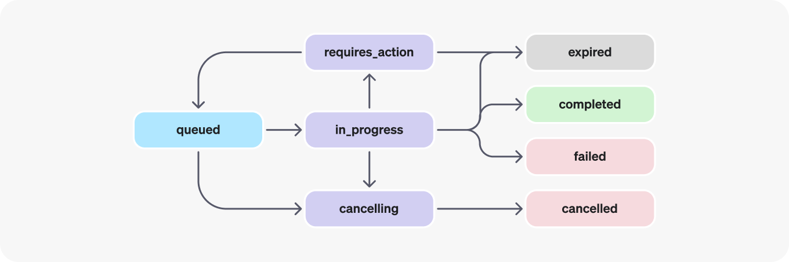
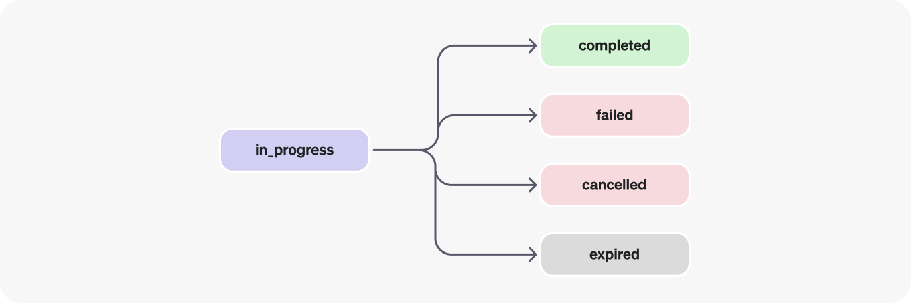

# OpenAI Assistants API: Function Calling 

If you've ever thought, "My AI assistant is smart, but I wish it could *do* more than just talk," then you're in the right place\! This powerful feature is a game-changer, transforming your AI assistant into a real-world problem-solver by letting it tap into external services, databases, and even your own custom code.

#### What Exactly is Function Calling? (The Simple Scoop)

Imagine you've got this incredibly smart AI assistant. It knows a ton of stuff because it's been trained on a massive amount of information. But here's the catch: its knowledge is a snapshot of the past. It can't, for example, tell you the *current* weather outside your window, find a restaurant that's *open right now*, or actually *book* that flight you're looking at.

This is precisely where **Function Calling** steps in.

In the easiest way to think about it, Function Calling allows your OpenAI Assistant to:

  * **Realize it needs a hand**: When you ask your Assistant something that requires fresh info or an action beyond its built-in brainpower (like "What's the temperature in Paris right now?"), it figures out, "Hmm, I can't answer that on my own."

  * **Know *who* to ask for help**: This is where *you* come in\! You, the developer, tell the Assistant about specific "tools" it has at its disposal. Think of these tools as specialized functions (pieces of code) that you've written. You describe exactly what each tool does and what kind of information it needs to do its job.

  * **Send out a request**: Here's the cool part: the Assistant doesn't just magically *do* the thing. Instead, it tells *your code* precisely which tool to use and what information to give that tool. It sends you a clear, structured "request" in a machine-readable format. It's like your Assistant saying, "Hey, I need the weather for Paris. Can you run the 'get\_current\_weather' tool with 'Paris' as the location?"

  * **Get the answer back**: Your code then takes that request, runs the actual tool (maybe it calls a weather API, queries a database, or does some calculations), and gets the result.

  * **Give you a smart reply**: With that fresh information from your tool, the Assistant can then craft a complete, accurate, and super-helpful response for you.

So, picture your Assistant as a brilliant team leader. It's great at strategy, but it relies on a team of specialized workers (your functions) to handle specific tasks and report back. Function Calling is simply how that team leader communicates with its expert crew. Pretty neat, right?

#### Why Bother with Function Calling? (The Big Perks)

Adding Function Calling to your AI applications brings some seriously awesome advantages:

  * **Your AI Can Do More**: Your assistant isn't stuck with just its old training data anymore. It can grab real-time info, chat with third-party services (like your payment systems, customer relationship management tools, or online stores), and even perform dynamic actions. It truly extends what your AI is capable of\!

  * **Real-World Interaction**: This isn't just about chatting; it's about *doing*. You can build assistants that actually book things, send messages, or update records. This opens up a world of possibilities for automating tasks, creating personalized experiences, and integrating AI deeply into your existing systems.

  * **Smooth, Reliable Talks**: When the Assistant wants to call a function, it gives you a clear, predictable output. This makes it super easy for your code to understand exactly what's needed and run the right function with the correct inputs. No guesswork involved\!

  * **Fewer "AI Hallucinations"**: By giving your AI specific tools for specific jobs, you're guiding it to get factual information or perform precise actions. This really helps cut down on those moments where the AI might just make things up.

  * **Connect to Anything**: Seriously, you can link your Assistant to almost any external system or API out there. As long as you can write a function to talk to it, your Assistant can use it\!

#### How Function Calling Actually Works (Step-by-Step, Under the Hood)

Let's walk through the typical journey of how Function Calling unfolds:

1.  **You Tell Your Assistant About Its Tools (Your Functions)**:
    Before your Assistant can use any fancy tools, you've got to introduce them. This means you tell it:

      * The **name** of the function (like `get_current_weather`).

      * A **description** of what it does (this is super important, as it helps the Assistant decide *when* to use it – be clear and concise\!).

      * A **parameters schema** (think of this as a blueprint) that spells out exactly what inputs your function needs, their types, and if they're required. This helps the Assistant grab the right info from your user's question.

    For example, you'd tell your Assistant that you have a tool called `get_current_weather`. It's for finding out weather. To use it, you *must* give it a `location` (like 'London, UK'). You can also optionally tell it the `unit` you prefer, either 'celsius' or 'fahrenheit'.

2.  **The User Chats with Your Assistant**:
    Someone using your application sends a message that might need some external data or action. For instance, they might type: "What's the weather like in Tokyo today?"

3.  **Your Assistant Decides to Call a Function**:
    The OpenAI model processes the user's message. It then looks at the descriptions of the tools you've given it. If it figures out that one of your tools can answer the user's question, it'll generate a "tool call" request. This request contains the name of the function it wants you to run and the specific arguments it pulled from the user's message, all neatly formatted. Remember, the Assistant *doesn't* run the function itself; it just tells *you* what to run and with what inputs.

    In this example, your Assistant is basically saying: "Okay, I need to do something. Specifically, I need you to run the `get_current_weather` function, and please pass 'Tokyo' as the `location`."

4.  **Your Code Jumps In and Runs the Actual Function**:
    Your application gets this "requires action" signal from the Assistant. You then look at the tool call request to find out the function name and its arguments. After that, your code executes your actual `get_current_weather` function. This is where the real work happens – maybe it makes a call to a weather API, queries a database, or runs some local calculations.

    So, your program reads the Assistant's request, sees it needs `get_current_weather` for "Tokyo," and then runs your actual function to fetch that information.

5.  **You Send the Function's Result Back to the Assistant**:
    Once your function has done its job and you have the result (like "25 degrees Celsius and sunny"), you send this output back to the Assistant using a special endpoint. It's super important to link this output to the correct request ID so the Assistant knows which specific question this answer belongs to.

    Basically, your program is telling the Assistant: "Hey, remember that weather question for Tokyo? Well, here's the answer: '25 degrees Celsius and sunny'\!"

6.  **The Assistant Gives You a Friendly Answer**:
    With the function's output now part of the conversation, the Assistant can craft a natural, easy-to-understand response for the user. For example: "The current weather in Tokyo is 25 degrees Celsius and sunny. Looks like a great day\!"

