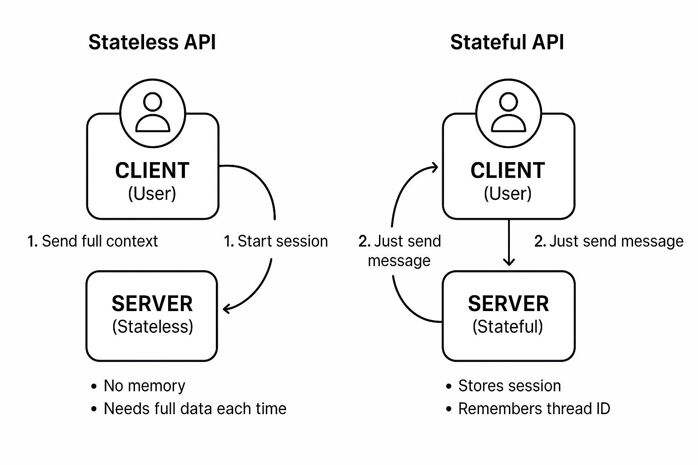

# Generative-AI-Learning-Path-From-Fundamentals-to-Advanced-Applications

#### **OpenAI APIs**

* **Chat Completions API** (`gpt-4`, `gpt-4o`, `gpt-3.5-turbo`)
* **Assistants API** (for tools, memory, threads, and more)
* **Function calling / tool use**
* **Vision (image-to-text)**
* **Text-to-speech (TTS)**
* **DALL·E (image generation and editing)**
* **Whisper (speech-to-text)**
* **Embeddings & vector search**
* **Rate limits, pricing, and quotas**
* **Best practices for performance, cost, or latency**
* **Fine-tuning and custom GPTs**
* **Integration with tools like Python, LangChain, FastAPI, etc.**

---

## OpenAI APIs: Chat Completions vs Assistants API

#### 🔹 Chat Completions API

> The `chat/completions` API is a **stateless interface** for interacting with OpenAI's language models. Every request must include the full conversation history, making it ideal for simple, short-lived tasks such as one-off completions, chatbots, summarizations, and prompt-based generation.

* **Endpoint:** `/v1/chat/completions`
* **Models Supported:** `gpt-3.5-turbo`, `gpt-4`, `gpt-4o`, etc.
* **Features:** Function calling, prompt engineering, tool usage
* **Stateless:** You must send the full message history each time.
* **Client-managed memory:** Context and history are handled by your application.

#### 🔸 Assistants API

> The `assistants` API is a **stateful orchestration layer** that enables the creation of persistent, multi-turn, tool-augmented AI agents. It supports built-in tools such as code execution, retrieval, and file handling, and maintains memory across sessions via threads.

* **Endpoints:** `/v1/assistants`, `/v1/threads`, `/v1/runs`, etc.
* **Supports:** Built-in tools (code interpreter, file search), persistent memory
* **Stateful:** OpenAI manages session context using `thread_id`
* **Server-managed memory:** Ideal for agents and long-running interactions.

---

### Feature Comparison

| Feature                  | **Chat Completions API**                   | **Assistants API**                           |
| ------------------------ | ------------------------------------------ | -------------------------------------------- |
| State                    | Stateless (send full context every time) | Stateful (context is stored on server)     |
| Memory Management        | Client-managed                             | Server-managed (via threads)                 |
| Multi-Turn Conversations | Manual history tracking                    | Built-in via threads and runs                |
| Tool Use                 | Functions / tools supported              | Built-in tools like code, retrieval, files |
| File Upload & Processing | Manual via file ID                      | Native support with `file_id` + assistants |
| Best For                 | Simple chatbots, one-off tasks             | Advanced agents, persistent assistants       |
| Flexibility              | Full control, manual orchestration         | Simplified with OpenAI-run orchestration     |

---

### When to Use Which

#### Use **Chat Completions API** when:

* You want **low-latency, simple** prompt/response generation
* You are manually managing session context in your app
* You are building classic REST-style interactions
* You don't need persistent memory or advanced tool orchestration

#### Use **Assistants API** when:

* You are building a **long-lived assistant or agent**
* You want to **offload context and session memory** to OpenAI
* You need built-in tools like **code interpreter**, **file Q\&A**, or **retrieval**
* You want OpenAI to manage multi-turn reasoning for you

---

### Real-World Example Use Cases

| Use Case                      | Chat Completions API | Assistants API     |
| ----------------------------- | -------------------- | ------------------ |
| File Q\&A Bot (PDFs, CSVs)    | Manual setup      | Native support   |
| AI Tutor with Memory          | Complex logic     | Easy to build    |
| Code Analysis Assistant       | (manual)           | (with code tool) |
| Conversational Agent          | Limited           | Ideal           |

---

